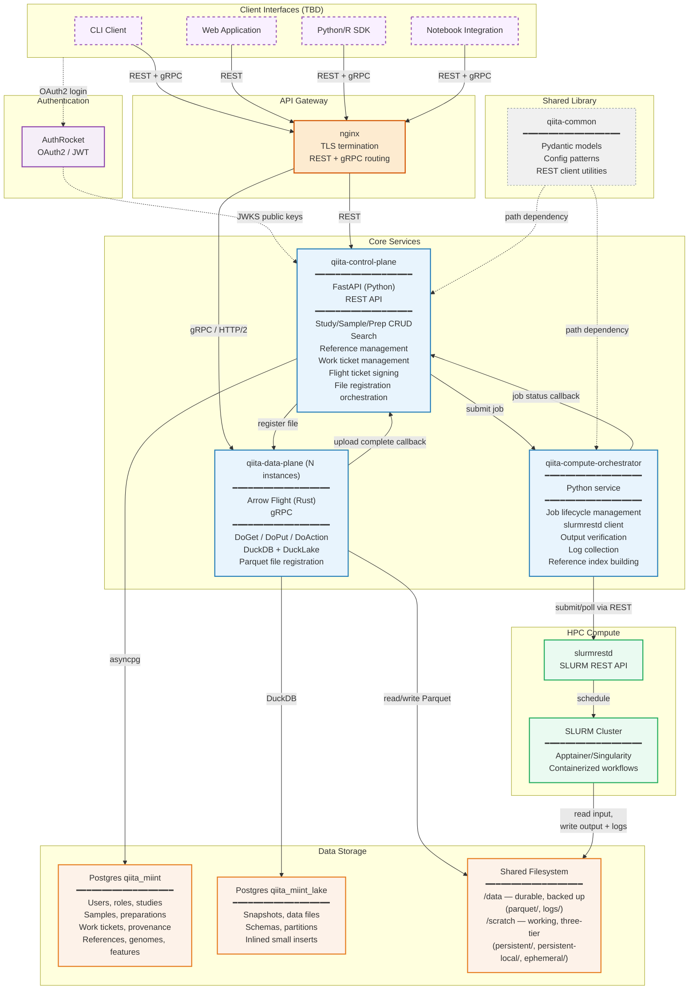
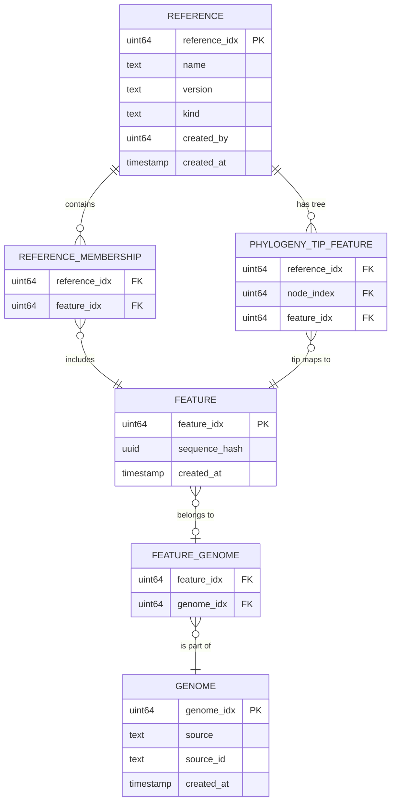
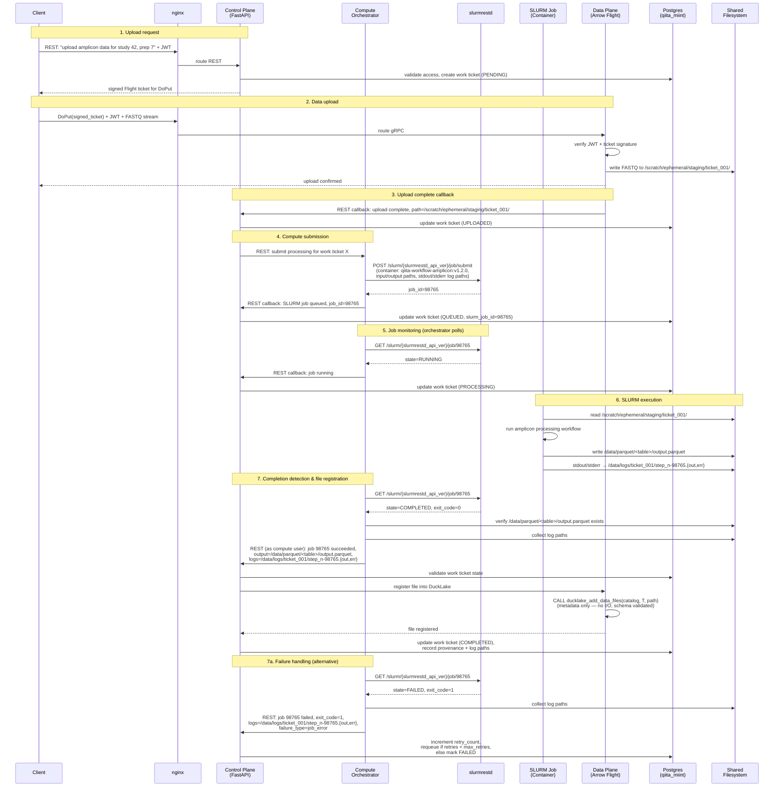
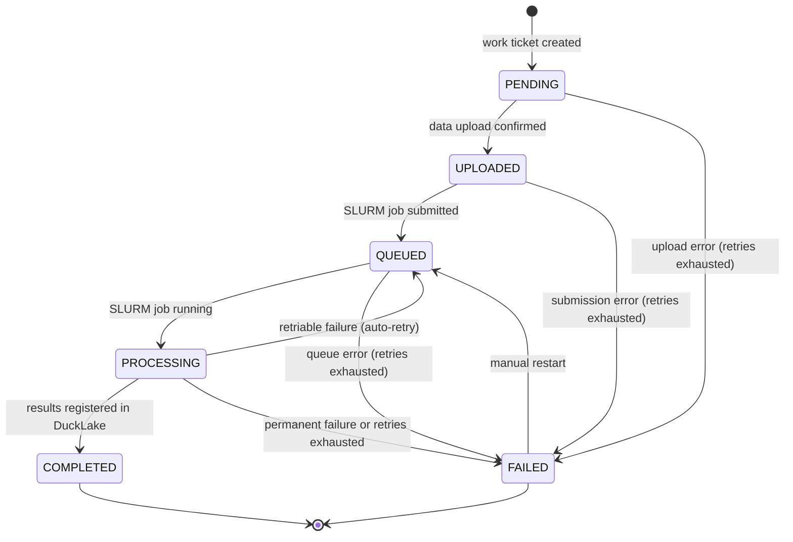

# Qiita Architecture

Qiita is a scalable multi-omic study management, processing, and analysis platform for microbiome data (amplicon, metagenomic, metatranscriptomic, metabolomic, proteomic). Schema informed by existing Qiita data model (carried forward surgically by human guidance) and BioSample (scope TBD).

**Scale:** Millions of samples, 100s of TB of data.

## System Architecture



**Legend:**
- **Solid lines** — runtime data/request flow
- **Dashed lines** — configuration/build-time dependencies
- **Purple dashed border** — Client interfaces (unresolved, to be discussed)

## Components

- **qiita-control-plane** — Client-facing REST API (Python 3.14, FastAPI, asyncpg, Postgres, dbmate, OpenAPI, PyTest, ruff, uv, GitHub Actions CI). Handles CRUD for study/sample/preparation, search, work ticket creation/management, and reference management (genome/feature/reference ID minting, reference membership, taxonomy authority registration). Signs Flight tickets (HMAC-SHA256) for client access to data plane. Orchestrates file registration in DuckLake (via data plane) after compute completion. Hosts the **workflow runner** (`qiita_control_plane.runner`) — for each work ticket, walks the action's `steps:` list, dispatching `action:` entries to in-process LIBRARY primitives and `step:` entries to the orchestrator's `POST /api/v1/step/run` endpoint over HTTP.
- **qiita-data-plane** — Data layer (Rust, arrow-flight, DuckDB v1.5.2, duckdb-miint extension, DuckLake w/ Postgres catalog). Arrow Flight protocol (gRPC-based). Intentionally "dumb" — select/insert/delete by exact integer identifiers. Clients connect directly through nginx. Verifies HMAC-signed Flight tickets issued by the control plane; performs no user authentication itself. Registers Parquet files into DuckLake via `ducklake_add_data_files` (metadata-only, no I/O). Runs as the dedicated `qiita-data` system user; verifies result file permissions before registration and rejects files that are not `440`. **Horizontally scalable**: each instance holds an independent DuckDB+DuckLake connection to the shared Postgres catalog; DuckLake's snapshot-isolated concurrent read model means multiple instances never block each other. nginx load-balances gRPC traffic across all instances.
- **qiita-compute-orchestrator** — Separate Python service for compute lifecycle management. Exposes `POST /api/v1/step/run` which the control-plane runner calls to dispatch a workflow `step:` entry; internally the orchestrator owns the SLURM lifecycle (submit via slurmrestd, poll for status, detect completion/failure, verify output, collect logs). SLURM jobs are truly dumb (read input, process, write output, exit). Also builds aligner indices for references (minimap2 `.mmi`, bowtie2) as SLURM batch jobs. Abstracts compute backend behind a clean `ComputeBackend` interface (`LocalBackend` for dev/test runs DuckDB+miint in-process; `SlurmBackend` is the production target). Has no direct DB access — the architectural intent is that the orchestrator only knows about identifiers it receives in `/step/run` requests.
- **qiita-common** — Shared Python library for control plane and compute orchestrator. Pydantic models (work ticket states, API request/response schemas), config patterns, and REST client utilities. Prevents drift between services' understanding of the API contract.
- **API gateway** — nginx: REST to qiita-control-plane, Arrow Flight/gRPC (HTTP/2+TLS) load-balanced across N qiita-data-plane instances.
- **Auth** — three principal kinds (human, service, anonymous). Humans authenticate via AuthRocket OIDC; services hold opaque PATs; CP↔DP traffic is HMAC-signed Flight tickets. See [`docs/auth.md`](auth.md) for the principal model, scopes, endpoints, and runbooks.
- **Client interfaces** — **[UNRESOLVED]** How users interact with Qiita. Placeholder candidates include: CLI tool, web application, Python/R SDK, and notebook integration. Details on which interfaces to build, their scope, and priorities are TBD. All client interfaces connect through nginx and authenticate via AuthRocket. REST-only clients interact with the control plane; clients needing bulk data transfer also use Arrow Flight (gRPC) to the data plane.

## Data Model

### Identifier Hierarchy

All identifiers are uint64, minted exclusively by the control plane. The data plane treats all identifiers as opaque integers.

- **`study_idx`** — unique identifier for a study. A study is a logical collection of samples and preparations, including meta-analyses that group `prep_sample_idx` values from other studies without uploading new data.
- **`prep_idx`** — unique identifier for a preparation (a set of observed data, e.g., a sequencing run). Belongs to one study.
- **`sample_idx`** — unique identifier for a physical sample. A study has one-to-many samples. A sample can appear across multiple studies (e.g., shared controls, meta-analysis groupings).
- **`prep_sample_idx`** — unique identifier for an instance of a physical sample on a preparation. A prep can carry the same physical sample multiple times (technical or biological replicates); a sample can appear on multiple preps. `prep_sample_idx` is the finest-grained unit of raw input data.
- **`processing_idx`** — unique identifier for a processing method: a specific `(workflow_name, workflow_version, parameter_set)` combination. Immutable once created. Reusable across preps and studies. Opaque integer in the data plane; detail lives in the control plane `processing_methods` table.
- **`processed_prep_sample_idx`** — unique identifier for the result of applying a `processing_idx` to a `prep_sample_idx`. Minted by the control plane before job submission. Processing cannot create new samples — all `processed_prep_sample_idx` values for a job are pre-assigned from the known `prep_sample_idx` set on the prep.

Reference identifiers form a parallel hierarchy for reference databases:

- **`reference_idx`** — unique identifier for a specific `(name, version)` pair of a reference database (e.g., "Greengenes2 2024.09", "WoL3 v1.0"). A reference is a curated, versioned collection of features. The `kind` field distinguishes sequence references from taxonomy authorities. Minted by the control plane.
- **`genome_idx`** — logical entity that spans references, representing a single genome regardless of which reference collections include it (e.g., "E. coli K-12 GCF_000005845"). Not all features are genomes — `genome_idx` is nullable for features like full-length 16S records or ASVs. Carries provenance: `source` (genbank, refseq, collaborator, qiita) and `source_id` (external accession when applicable, e.g., a GenBank or RefSeq accession). Minted by the control plane.
- **`feature_idx`** — unique identifier for a specific sequence, deduplicated by MD5 hash: identical bytes always resolve to the same `feature_idx`. One genome has one or more features (contigs, chromosomes). Features are the unit of coordinate space — alignments and annotations use positions relative to a `feature_idx`. Minted by the control plane; sequence data stored in the data plane.

`feature_idx` is the bridge between sample processing results (alignment detail, counts) and reference data (sequences, taxonomy, annotations, phylogeny). Alignment output contains `feature_idx` but not `reference_idx` — reference scoping is a query-time join against `reference_membership`.

Raw-read identifiers extend the prep_sample hierarchy:

- **`sequence_idx`** — globally-unique bigint identifying a single raw read stored in the data plane. Minted by the control plane in contiguous ranges of caller-specified size via `POST /api/v1/sequence-range`, recorded in `qiita.sequence_range` (1:1 with `prep_sample_idx`, kind-pinned to `processing_kind='sequenced'` via composite FK), and never recycled — a deleted range's `sequence_idx` values stay consumed in `qiita.sequence_idx_seq`. The endpoint is service-account-only (`sequence_range:mint` scope); the compute orchestrator obtains a range before writing raw-read Parquet to the data plane.

### Processing Methods

`processing_idx` detail lives in the control plane `processing_methods` table:

| Column | Type | Notes |
|---|---|---|
| `processing_idx` | uint64 PK | |
| `workflow_name` | text | |
| `workflow_version` | text | |
| `parameters_hash` | text | SHA-256 of canonical JSON parameters; deduplication key |
| `parameters_jsonb` | jsonb | full parameter set |
| `created_at` | timestamp | |
| `created_by` | text | |

Two submissions with identical `(workflow_name, workflow_version, parameters)` resolve to the same `processing_idx` via `parameters_hash` — the control plane upserts on this key rather than minting a duplicate.

### Identifier Columns in Parquet

All result Parquet files must include these columns, in this order, and be sorted by them:

```
study_idx  prep_idx  sample_idx  prep_sample_idx  processing_idx  processed_prep_sample_idx
```

This sort order provides two compounding layers of query optimisation:

- **DuckLake catalog** (`ducklake_file_column_stats`): min/max per column per file stored in Postgres. Any query filtering on identifier columns prunes whole files before DuckLake opens anything.
- **Parquet row group statistics**: sorted data produces tight, non-overlapping min/max ranges per row group — predicate pushdown skips row groups with zero false positives for point lookups and range scans. Without sorting, row group ranges overlap and pushdown degrades to near-useless for selective queries.

The sort is enforced in the reduce step (see Compute Orchestrator), so it is consistent regardless of what the map phase produces.

Alignment and count result tables extend this base sort with reference columns. Alignment detail Parquet uses the sort order `(study_idx, prep_idx, sample_idx, prep_sample_idx, processing_idx, processed_prep_sample_idx, feature_idx, position)` — the trailing `feature_idx, position` exploits genome locality so that reads hitting the same region of the same feature are physically adjacent. Count/aggregation Parquet uses `(..., feature_idx)` without `position`. Crucially, these tables contain `feature_idx` but **not** `reference_idx` — this means alignment and count data do not need to be recomputed when a feature is added to or removed from a reference version. Scoping results to a specific reference version is a query-time join against the `reference_membership` table.

### Sample Metadata

Sample metadata — descriptive attributes of physical samples (specimen type, collection site, host age, treatment status, environmental parameters, etc.) — lives exclusively in the control plane (Postgres app DB) as attributes on `sample_idx` and related entities. It does not exist in the data plane.

Reasons:
- Metadata is structured relational data tightly coupled to the identifier model already in the control plane
- Schema validation against BioSample / MIMARKS compliance requirements is enforced at insert time
- Metadata and processed measurement data have different update semantics — a metadata correction (e.g., fixing a mislabelled collection site) does not invalidate or require reprocessing of any Parquet files in the data plane
- Access control decisions are already made in the control plane; metadata-driven filtering is a natural extension of the same authorization layer

**Search pattern:** the control plane exposes search and filter endpoints over metadata. A client submits a query (e.g., "fecal samples from antibiotic-naive subjects in study X"), receives the authorized set of `prep_sample_idx` (or `processed_prep_sample_idx`) identifiers matching the criteria, and uses those IDs directly against the data plane. The control plane search is the access control gate — clients only receive IDs they are authorized to access. The data plane never evaluates metadata; it serves measurements for the requested IDs, relying on the sorted Parquet structure and DuckLake column statistics for efficient lookup.

### Raw Data Fingerprint

A SHA-256 fingerprint of uploaded raw data is recorded per `prep_sample_idx` at upload time in the control plane. Its purpose is **upload-time duplicate detection only** — it is not the processing deduplication key:

- Warns users when uploaded data appears identical to an existing `prep_sample_idx`
- Surfaces accidental duplicate uploads before compute is wasted
- Provides the basis for storage deduplication (one physical file, multiple logical references) as a future optimisation

### Processing Deduplication and Disallow-Without-Delete

The control plane gates all job submission on the current state of each `(prep_sample_idx, processing_idx)` pair. Before submitting any work:

- **COMPLETED**: disallow — require explicit DELETE before resubmission
- **PENDING, QUEUED, or PROCESSING**: disallow — work is already in flight; submitting again would produce duplicate compute for the same result
- **FAILED** or absent: allow submission

This check applies at both the work ticket level (is there an active ticket for this prep + processing combination?) and the individual sample level (does any `prep_sample_idx` in the request already have a result in a non-terminal state?), preventing both whole-prep and partial duplicate submissions.

The data plane asserts identifier integrity programmatically since DuckLake does not support explicit constraints (no unique constraints, no foreign keys at the DuckLake level):

- **At registration**: before `ducklake_add_data_files`, verifies the Parquet file's `processed_prep_sample_idx` values are a subset of the expected set provided by the control plane, and that no value from the file already exists in the catalog for this `(prep_idx, processing_idx)` combination.
- **At service startup**: scans the DuckLake catalog to verify no `processed_prep_sample_idx` appears in multiple active files for the same `(prep_idx, processing_idx)`. Violations are logged as critical errors and the affected combinations are blocked from serving until reconciled.

### Reference Database Design

Reference databases — curated collections of sequences, taxonomies, annotations, and phylogenies — are central to alignment-based analyses. The reference design uses a three-level identity model to decouple individual sequences from the logical genomes they belong to and the versioned reference collections they appear in.

#### Three-Level Identity Model



The three levels:

- **`reference_idx`** — a versioned reference collection. Each `(name, version)` pair gets a unique `reference_idx`. The `kind` field distinguishes sequence references (`sequence_reference`) from taxonomy authorities (`taxonomy_authority`). Examples: Greengenes2 2024.09, WoL3 v1.0, RS225, NCBI Taxonomy 2025-03.
- **`genome_idx`** — a logical genome that persists across references. When the same genome appears in WoL3 and RS225, both link to the same `genome_idx`, enabling cross-reference queries ("is this the same genome in WoL3 and RS225?"). Not all features are genomes — `genome_idx` is nullable for features like full-length 16S records or ASVs that have no corresponding genome. Carries provenance via `source` (genbank, refseq, collaborator, qiita) and `source_id` (external accession when applicable).
- **`feature_idx`** — a specific sequence, deduplicated by MD5 hash (computed by DuckDB's `md5()` on sequences read via miint). Identical bytes always resolve to the same `feature_idx`. A genome is composed of one or more features (one per contig/chromosome) — there is no genome linearization. Alignments and annotations use coordinates relative to a `feature_idx`.

Junction tables:

| Table | Key | Purpose |
|---|---|---|
| `reference_membership` | `(reference_idx, feature_idx)` | Which features belong to which reference version |
| `feature_genome` | `(feature_idx, genome_idx)` | Which genome a feature belongs to (not all features have a genome) |
| `phylogeny_tip_feature` | `(reference_idx, node_index, feature_idx)` | Maps phylogeny tip nodes to their corresponding feature sequences |

A feature may belong to multiple references (e.g., the same contig in WoL3 and RS225). A genome may contain multiple features (e.g., a multi-contig assembly). MD5-based deduplication ensures that if two references include the same sequence bytes, they share one `feature_idx` — no data is duplicated.

#### Control Plane vs. Data Plane Split

All ID minting and membership management lives in the control plane (Postgres OLTP). Bulk sequence data, taxonomy, annotations, phylogeny, and analysis results live in the data plane (DuckLake OLAP).

**Control plane (`qiita_miint`):**

| Table | Key columns | Purpose |
|---|---|---|
| `reference` | `reference_idx` PK | Reference-level metadata: name, version, kind, creator, timestamps |
| `genome` | `genome_idx` PK | Genome provenance: source, source_id, timestamps |
| `feature` | `feature_idx` PK | Feature identity: sequence_hash, timestamps |
| `reference_membership` | `(reference_idx, feature_idx)` | Which features are in each reference version |
| `feature_genome` | `(feature_idx, genome_idx)` | Feature-to-genome mapping |
| `phylogeny_tip_feature` | `(reference_idx, node_index, feature_idx)` | Tip node → feature mapping for phylogeny traversal |

**Data plane (DuckLake):**

| Table | Sort / partition key | Contents |
|---|---|---|
| Reference sequences | `feature_idx` | `(feature_idx, sequence, sequence_hash, length)` |
| Reference taxonomy | `(reference_idx, feature_idx)` | Taxonomy assignments — reference-version-specific. Rank columns (domain through species) plus `ncbi_taxon_id` when available |
| Reference annotations | `(feature_idx, position)` | GFF-like: `(feature_idx, source, type, position, stop_position, score, strand, phase, attributes)` — gene models, CDS, regulatory regions |
| Reference phylogeny | `(reference_idx, node_index)` | Per-reference tree: `(reference_idx, node_index, name, branch_length, edge_id, parent_index, is_tip)` — Newick trees decomposed into node tables via `read_newick` |
| Placements | `(reference_idx, fragment)` | jplace data stored as-is via `read_jplace`; reconciled against reference membership and phylogeny at query time |
| Alignment detail | `(study_idx, ..., feature_idx, position)` | Per-read alignment results sorted for genome locality: `(study_idx, prep_idx, sample_idx, prep_sample_idx, processing_idx, processed_prep_sample_idx, feature_idx, position)` |
| Count / aggregation | `(prep_sample_idx, ..., feature_idx)` | Sparse COO format: `(study_idx, prep_idx, sample_idx, prep_sample_idx, processing_idx, processed_prep_sample_idx, feature_idx, value)` |

#### Taxonomy as a Reference

NCBI Taxonomy (and similar taxonomy authority systems) are modeled as references with `kind = 'taxonomy_authority'`. This means:

- An NCBI Taxonomy release gets its own `reference_idx`, just like any sequence reference
- Taxonomy versions are tracked with the same machinery as sequence reference versions
- If GTDB, Silva, or other taxonomy systems are added, they are additional taxonomy authority references — no special-case code

A genome or feature may have taxonomy assignments from multiple sources (e.g., both a sequence reference's taxonomy and the NCBI taxonomy authority). Both are rows in the taxonomy table keyed on `(reference_idx, feature_idx)` — the `reference_idx` distinguishes the source. The `ncbi_taxon_id` column is stored alongside the rank strings for features that have an NCBI assignment, enabling joins to external NCBI data.

#### Annotations

Functional annotations (gene models, CDS, regulatory features) follow a GFF3-compatible schema in the data plane, parsed via the miint `read_gff` table function. Annotations are keyed on `(feature_idx, position)` — they describe coordinates on a specific sequence.

Non-taxonomic annotation systems (KEGG, COG, Pfam) are normalized under the GFF schema where feasible, using the `source` and `type` columns to distinguish annotation origins and the `attributes` MAP for system-specific metadata.

#### Phylogeny and Placements

Reference phylogenies are stored as node tables decomposed from Newick files via the miint `read_newick` table function. Each tree is keyed on `reference_idx` and contains `(node_index, name, branch_length, edge_id, parent_index, is_tip)` per node. The miint internal phylogeny data model is compatible with this schema.

**Tip-to-feature mapping:** The `phylogeny_tip_feature` junction table (control plane, Postgres) maps `(reference_idx, node_index)` → `feature_idx` for tip nodes. This is populated at reference ingestion time (step 6 of bulk ingestion) by matching tip names in the Newick tree to features already registered in `reference_membership`. The mapping enables phylogeny-rooted queries: traverse the tree to collect descendant tips via `parent_index`, then join through `phylogeny_tip_feature` to reach `feature_idx` and from there to alignment/count tables. Internal nodes are addressed by `(reference_idx, node_index)` — they do not have a global identifier and are not referenced across trees.

Phylogenetic placements (jplace format) are stored as raw placement data via `read_jplace` rather than resolved into the tree. Reconciliation of placements against the reference phylogeny happens at processing time or on user queries, keeping the stored data independent of tree topology changes.

#### Aligner Index Storage

Aligner indices (minimap2 `.mmi`, bowtie2 `.bt2`) are built by the compute orchestrator as SLURM batch jobs and stored on the shared filesystem. The tier root is `/scratch/persistent-local/` for random-access aligner indices, or `/scratch/persistent/` for built reference data whose access pattern doesn't justify the local-SSD copy; the subtree below is identical either way:

```
<persistent-tier-root>/references/{reference_idx}/
├── minimap2/
│   └── index.mmi
├── bowtie2/
│   ├── index.1.bt2
│   ├── index.2.bt2
│   └── ...
└── metadata.json        # build provenance, aligner versions, parameters
```

The control plane records which aligner indices exist for each reference version. Processing workflows reference aligner indices by `reference_idx` in their `params.json`. When a new reference version is cut, index building is submitted as a follow-up SLURM job through the orchestrator.

#### Bulk Reference Ingestion

Adding a new reference (potentially millions of sequences) is a multi-step pipeline through the compute orchestrator, not the control plane's web process:

1. A user with appropriate role initiates reference creation via the control plane REST API, providing source data paths on the shared filesystem
2. The control plane creates the `reference_idx` and submits a **hash job** to the compute orchestrator
3. The SLURM hash job reads sequences using DuckDB + miint (`read_fastx`), computes MD5 hashes via DuckDB's built-in `md5()`, and writes a manifest (hash, sequence identifier, length, metadata) to the output directory
4. The orchestrator reads the manifest and sends hashes to the control plane in bulk
5. The control plane does a bulk dedup lookup against the `feature` table (`sequence_hash` unique index), reuses existing `feature_idx` for matches, mints new `feature_idx` for novel sequences, writes `reference_membership` and `feature_genome` records, and returns the `{hash → feature_idx}` mapping to the orchestrator
6. The orchestrator submits a **load job** with the ID mapping; the SLURM job loads sequences, taxonomy, annotations, and phylogeny into DuckLake tables using the assigned `feature_idx` values. For references with a phylogeny, the load job also resolves tip names to `feature_idx` and the orchestrator writes `phylogeny_tip_feature` records to the control plane
7. On completion, the orchestrator submits an **index build job** to create aligner indices (minimap2 `.mmi`, bowtie2)
8. The control plane records the reference as active once all jobs complete

This keeps the control plane's API process lean — it handles only lightweight OLTP (ID minting, membership writes, bulk dedup lookups), while the heavy I/O (reading sequences, computing hashes, loading data, building indices) is delegated to SLURM.

#### Scale

| Reference | Approximate size |
|---|---|
| Greengenes2 | ~20M records (300K full-length 16S + ASVs) |
| Web of Life 3 (WoL3) | ~233K genomes |
| RS225 | ~55K genomes (partial overlap with WoL3; includes some eukaryotes) |

Currently ~5 references, growing. New sequences are added via online update; periodic version cuts create new `reference_idx` values with updated membership sets.

#### Example Query Patterns

These queries demonstrate the join patterns the reference design supports:

1. **Taxon-scoped sample data:** "Give me all sample data where matched reference features belong to taxon X" — join reference taxonomy → reference membership → alignment/count tables. The taxonomy join filters by `reference_idx` and taxon; the membership join maps features to the reference version; the alignment join retrieves sample data by `feature_idx`.

2. **Taxon + gene intersection:** "Give me all reads with alignments to taxon X and gene Y" — join reference taxonomy + GFF annotations (both keyed on `feature_idx`) → alignment detail. All joins stay in the data plane for high-throughput analytical queries.

3. **Reference-only queries:** "Give me all sequences in family Lachnospiraceae from Greengenes2" — pure data plane: filter taxonomy table by rank, join to sequences table via `feature_idx`. High-throughput scan, no sample data involved.

4. **Cross-reference identity:** "Is this the same genome in WoL3 and RS225?" — join `reference_membership` for both references through `feature_idx` to `feature_genome`, comparing `genome_idx`. Shared `genome_idx` confirms cross-reference identity.

5. **Sequences by identifier:** "Give me the sequence for feature_idx 42" — direct lookup in the reference sequences table. Also supports bulk retrieval by identifier set via standard Flight ticket pattern.

6. **Clade-scoped sample data:** "Give me all sample counts under this clade in the WoL3 tree" — the control plane resolves the clade to a `feature_idx` set: recursive CTE on the phylogeny node table (DuckLake, via data plane) to collect descendant tip `node_index` values, then join through `phylogeny_tip_feature` (Postgres) to get the `feature_idx` set. The control plane signs a Flight ticket scoped to those `feature_idx` values, and the data plane serves the count/alignment data. Same pattern as reference-scoped queries — the control plane resolves the identifier set, the data plane serves the data.

## Client Interfaces (Unresolved)

Client interfaces are the user-facing layer through which researchers and systems interact with Qiita. All interfaces authenticate via AuthRocket (OAuth2/JWT) and connect through the nginx gateway.

**Candidate interfaces** (to be discussed):
- **CLI** — command-line tool for scripted/automated workflows. Would speak both REST (control plane) and Arrow Flight (data plane) for data upload/download.
- **Web application** — browser-based UI for study management, search, and monitoring. REST-only (control plane). Bulk data transfer would be delegated to CLI or SDK.
- **Python/R SDK** — programmatic library for use in analysis scripts and pipelines. Would wrap both REST and Arrow Flight APIs, providing native DataFrame integration (pandas, polars, R data.frame).
- **Notebook integration** — Jupyter/RStudio integration, likely built on top of the SDK.

## Arrow Flight Operations (no custom .proto needed)

- **DoGet**: select by key (table + integer identifiers encoded in signed Flight ticket)
- **DoPut**: upload data (stream RecordBatches to shared filesystem via FlightDescriptor, authorized by signed action token)
- **DoAction**: register file (`ducklake_add_data_files`), delete by key, insert-from-processing-method (authorized by signed action token)

## Auth & Data Access Flow

See [`docs/auth.md`](auth.md) for the principal model, login flow, scopes, endpoints, and runbooks.

## Data Upload & Processing Workflow



**Text flow:**

1. **Upload request:** Client sends REST request to control plane with JWT. Control plane validates access, creates a work ticket (PENDING), and returns a signed Flight ticket authorizing a DoPut upload.
2. **Data upload:** Client streams raw data (e.g., FASTQ) to the data plane via Arrow Flight DoPut through nginx. Data plane verifies JWT and ticket signature, writes data to the shared filesystem at a structured staging path.
3. **Upload complete callback:** Data plane calls back to control plane with the staging path. Control plane updates the work ticket to UPLOADED.
4. **Compute submission:** Control plane requests the compute orchestrator submit a SLURM job via slurmrestd. The job specifies a container image (e.g., `qiita-workflow-amplicon:v1.2.0`), input/output paths on the shared filesystem, and stdout/stderr log paths. SLURM jobs have no knowledge of the control plane — they are truly dumb (read input, process, write output, exit). Compute orchestrator returns the SLURM job ID. Control plane updates the work ticket to QUEUED.
5. **Job monitoring:** Compute orchestrator polls slurmrestd for job status. When the job transitions to RUNNING, it notifies the control plane. Control plane updates the work ticket to PROCESSING.
6. **SLURM execution:** The containerized workflow runs on the SLURM cluster, reading input from the staging path on the shared filesystem and writing Parquet results to the results path. Stdout/stderr are captured to log files on the shared filesystem.
7. **Completion detection & file registration:** Compute orchestrator detects job completion via slurmrestd polling. It verifies the output file exists on the shared filesystem, collects log file paths, and calls the control plane. Control plane validates the work ticket state, then instructs the data plane to register the Parquet file into DuckLake via `ducklake_add_data_files` (metadata-only operation — no I/O, only schema validation). On success, the control plane updates the work ticket to COMPLETED and records provenance (who, what, when, which workflow version, SLURM job ID, log paths).
7a. **Failure handling:** If the SLURM job fails, the compute orchestrator detects the failure, collects log paths, and reports to the control plane with the failure type and exit code. The control plane increments the retry count. If retries remain, it requeues the job (back to QUEUED). If max retries are exhausted, it marks the work ticket as FAILED with the failure reason, stage, and log paths for diagnosis.

## Work Ticket Lifecycle



States:
- **PENDING** — work ticket created, awaiting data upload
- **UPLOADED** — raw data on shared filesystem, awaiting compute submission
- **QUEUED** — SLURM job submitted, waiting for cluster resources (slurm_job_id recorded)
- **PROCESSING** — SLURM job actively running on cluster
- **COMPLETED** — results registered in DuckLake, provenance recorded
- **FAILED** — failure at any stage, retries exhausted or permanent failure

Work ticket fields (per `qiita.work_ticket` migration `20260504000001_work_ticket.sql`):
- `work_ticket_idx` — primary key
- `action_id`, `action_version` — FK into `qiita.action`; pin the exact action definition this ticket was submitted against
- `originator_principal_idx` — submitter; FK into `qiita.principal`
- `scope_target_kind` plus one of `(study_idx, prep_idx)` or `reference_idx` — tagged-union scope target, governed by the `work_ticket_scope_target_consistent` CHECK
- `action_context` — JSONB validated at submission against `action.context_schema`
- `state` — `pending` / `queued` / `processing` / `completed` / `failed`
- `retry_count` — number of retry attempts so far (incremented on each PROCESSING → QUEUED retry)
- `max_retries` — per-ticket retry budget (default 3, max 100)
- `failure_type` — `retriable` or `permanent`; non-NULL on FAILED, NULL otherwise (CHECK enforced)
- `failure_stage` — coarse stage enum: `submission` / `step_run` / `finalize`
- `failure_step_name` — YAML step name when `failure_stage = step_run`; NULL otherwise (CHECK enforced)
- `failure_reason` — human-readable explanation
- `created_at`, `updated_at` — timestamps

The schema does not carry per-step provenance fields (slurm_job_id, log paths, current_step / total_steps, provenance JSONB, completed_at). The runner is synchronous and waits inline for each step; SLURM-side log retrieval is on the orchestrator and not surfaced on the work_ticket row.

Failure classification is finer-grained at the backend layer: `BackendFailure.kind` is one of the values in `qiita_common.backend_failure.FailureKind` (NODE_FAIL, OOM_KILLED, PREEMPTED, TIMEOUT_BEFORE_START, TRANSIENT_FS_ERROR, SLURMRESTD_UNREACHABLE, PROCESS_RESTARTED for retriable; BAD_INPUT, EXIT_NONZERO, CONTRACT_VIOLATION, UNKNOWN_PERMANENT for permanent). The runner collapses these to the two-valued `failure_type` for storage; `failure_reason` carries the kind name + per-failure detail for triage.

Retry semantics (implemented in `qiita_control_plane.runner._run_entry_with_retry`):
- On `BackendFailure(transient=True)` and `retry_count < max_retries`: bump `retry_count`, atomically transition `PROCESSING → QUEUED → PROCESSING`, retry the same entry. Earlier successful entries are not re-run — `bound` outputs carry forward.
- On `BackendFailure(transient=True)` with retries exhausted: transition to `FAILED` with `failure_type=retriable` (so post-mortems can distinguish "exhausted retries on a transient kind" from "permanent on first attempt").
- On `BackendFailure(transient=False)`: skip the retry loop, transition straight to `FAILED` with `failure_type=permanent`.
- On any other unwrapped `Exception` (LIBRARY primitive raising plain Python, programming bug): treat as `permanent`, `failure_type=permanent`, `failure_reason="<ExceptionType>: <message>"` truncated to 2000 chars.

Manual restart (`POST /api/v1/work-ticket/{idx}/run` on a `FAILED` ticket):
- Atomic UPDATE: state ← PENDING, `retry_count = 0`, all `failure_*` columns ← NULL (the DB CHECK requires `failure_*` all-NULL when state ≠ failed; the route clears them in one statement).
- Triggers a fresh in-process dispatch via `schedule_dispatch`. The original FAILED-row state is not preserved on the row itself; ops dashboards that want post-mortem retention should snapshot the `failure_*` fields before triggering /run.

**Single-CP-process contract.** The control plane runs as a single
`qiita-control-plane.service` instance. Dispatch tasks are bound to the
asyncio loop of the process that submitted them; a CP restart loses
those tasks. To recover, the lifespan startup hook unconditionally marks
every PENDING / QUEUED / PROCESSING ticket FAILED via
`recover_orphaned_tickets`, on the assumption that no other CP process
is concurrently dispatching. Running multiple CP processes against the
same database would have one process fail tickets the other is actively
running. Adding a CP HA topology requires fencing the sweep (per-process
owner column or advisory lock) before lifting that restriction.

## Compute Orchestrator

Separate Python service responsible for the full compute job lifecycle. SLURM-backend operational setup — cluster prerequisites, identity model, the `qiita-job` JWT auto-refresh timer — lives in [`docs/runbooks/slurm-backend-setup.md`](runbooks/slurm-backend-setup.md).

**Lifecycle ownership:** The compute orchestrator owns everything between "submit job" and "report result to control plane." SLURM jobs have no knowledge of the control plane — they are truly dumb (read input, process, write output, exit). As their final act before exiting, jobs must `chmod 440` all output files and write a manifest (see Container Contract below). The data plane enforces the permission check as a pre-registration gate.

**Multi-step workflows:** Workflows consist of one or more sequential steps, each with independent resource requirements and a step type of `map` or `reduce`. Steps are submitted as separate SLURM jobs so each is sized for its actual resource needs.

**Step types:**

- **`map`** — sample-independent. The orchestrator fans out one SLURM job per `prep_sample_idx` in parallel. Each job receives a `params.json` containing the full identifier set for that sample plus processing parameters, and produces a single-sample Parquet to its own output directory. Map jobs are retried independently — a failed sample is retried without reprocessing survivors. `failed_samples` on the work ticket accumulates any `prep_sample_idx` values that exhaust retries.
- **`reduce`** — prep-level. Executes once all map jobs for the preceding step have completed. Receives all surviving map output directories as its input. Must produce a single Parquet sorted by `(study_idx, prep_idx, sample_idx, prep_sample_idx, processing_idx, processed_prep_sample_idx)`. Two reducer implementations:
  - **`platform/sort-merge`**: generic platform-provided container — DuckDB reads all input Parquet files, sorts by the standard identifier columns, writes output. No workflow-specific code required for pure aggregation.
  - **workflow-specific**: custom container for cross-sample computation (normalisation, diversity metrics, etc.). Must still output sorted by the standard identifier columns as part of the container contract.

The orchestrator drives execution:

1. For each `map` step: write per-sample `params.json`, fan out N SLURM jobs (one per `prep_sample_idx`), poll all, retry failed samples independently, accumulate `failed_samples`
2. For each `reduce` step: write `params.json` containing the expected `processed_prep_sample_idx` set for surviving samples, submit one SLURM job with all map output directories as input, poll to completion
3. Verify three-gate output for every job (map and reduce)
4. Advance `current_step` on the work ticket and continue
5. After the final step, call back to the control plane to trigger data plane registration

Intermediate outputs: `/scratch/ephemeral/staging/{ticket_id}/step_{n}/{prep_sample_idx}/` (map), `/scratch/ephemeral/staging/{ticket_id}/step_{n}/` (reduce). Final-step outputs land directly in `/data/parquet/{table}/` so the data plane can register them via in-place `ducklake_add_data_files` without a cross-filesystem move.

Failure records which step failed (`failed_stage=processing_step_{n}`). Manual restart resets to step 0.

**Container contract:** Every workflow container must honour this interface regardless of what it does internally. Violations are rejected by the orchestrator's output verification gates and treated as permanent failures.

Inputs (orchestrator provides before submission):
- `QIITA_INPUT_PATH` env var — directory to read input from
- `QIITA_OUTPUT_PATH` env var — directory to write output to
- `$QIITA_INPUT_PATH/params.json` — written by the orchestrator; absent if the step has no parameters

For `map` steps, `params.json` contains the sample's full identifier set and processing parameters:
```json
{
  "study_idx": 1, "prep_idx": 3, "sample_idx": 7,
  "prep_sample_idx": 42, "processing_idx": 10, "processed_prep_sample_idx": 99,
  "parameters": { }
}
```

For `reduce` steps, `params.json` contains the prep-level identifiers, the surviving sample set, and any parameters:
```json
{
  "study_idx": 1, "prep_idx": 3, "processing_idx": 10,
  "surviving_samples": [
    {"prep_sample_idx": 42, "processed_prep_sample_idx": 99}
  ],
  "parameters": { }
}
```

Outputs (container must produce):
- All output files written to `$QIITA_OUTPUT_PATH`
- `$QIITA_OUTPUT_PATH/manifest.json` written as the final act before chmod, with two fields:
  ```json
  {
    "files": [{"path": "output.parquet", "size_bytes": 12345678}],
    "outputs": {"manifest": "output.parquet"}
  }
  ```
  `files` is the audit list — every file the container wrote, with declared sizes for the verifier to check. `outputs` maps the YAML step's declared `outputs:` names to relative paths under `$QIITA_OUTPUT_PATH`; use `"."` for an output that IS the directory (e.g. a step whose output is `staging_dir`).
- All files in `$QIITA_OUTPUT_PATH` set to `chmod 440` (including the manifest)
- Exit code 0 on success, non-zero on any failure

The container must not read from anywhere other than `$QIITA_INPUT_PATH`, must not write to anywhere other than `$QIITA_OUTPUT_PATH`, and must have no knowledge of Qiita, the control plane, or any service credentials.

Orchestrator verification gates (all must pass before a step is accepted):
1. Exit code 0
2. `$QIITA_OUTPUT_PATH/manifest.json` exists, parses as JSON, has both `files` and `outputs` keys
3. Every file listed in `files` exists at its declared `size_bytes`
4. The `outputs` map's relative paths resolve under `$QIITA_OUTPUT_PATH` (no traversal) and exist
5. Every file under `$QIITA_OUTPUT_PATH` is mode `0o440` and is listed in `files` (no extras)

A gate failure after exit code 0 is a permanent failure — the container returned 0 but didn't honor the contract, so retry won't help. SlurmBackend wraps the resulting failures as `BackendFailure(kind=CONTRACT_VIOLATION, transient=False)`.

**Primary backend:** SLURM via slurmrestd REST API (JWT auth).
- Submits jobs as JSON (no `#SBATCH` directives — slurmrestd ignores them)
- Environment variables explicitly specified in submission payload
- Polls job status via `GET /slurm/{slurmrestd_api_ver}/job/{job_id}` (version is a config parameter; target SLURM ≥ 25.x.x)
- Runs output verification gates on completion
- Reports results back to control plane via REST callback after all steps pass
- Shared filesystem assumed for all data I/O

**Job logging:** SLURM captures stdout/stderr to files on the shared filesystem at `/data/logs/{study_id}/{prep_id}/{ticket_id}/step_{n}-{slurm_job_id}.{out,err}`. All step log paths are recorded on the work ticket.

**Workflow containerization:** Apptainer/Singularity for HPC compatibility. (Apptainer is the Linux Foundation continuation of Singularity; the `singularity` command is typically aliased to `apptainer`.)
- Container images per workflow step, versioned (e.g., `qiita-workflow-amplicon:v1.2.0`)
- Workflow definitions in monorepo as config: ordered steps, each with container image, entrypoint, and resource requirements
- No root required (runs unprivileged)
- SLURM submits via `srun apptainer exec` or native integration

**Workflow runtimes (`container:` vs `module:`).** Each `step:` entry in a workflow YAML declares exactly one of two runtimes. `container:` names an apptainer image; the SBATCH script invokes `apptainer exec <image> [entrypoint]`. `module:` names a Python module path under `qiita_compute_orchestrator.jobs.*`; the SBATCH script invokes `srun python -m qiita_compute_orchestrator.jobs --job <short_name>` against the orchestrator's installed Python environment on the compute node. Native steps are the right choice when a step's only dependencies are already in `qiita-compute-orchestrator`'s `pyproject.toml`; container steps are required when the step pulls in heavier bioinformatics deps or system packages.

Every native job module exports exactly two symbols: a `class Inputs(BaseModel)` declaring its typed input contract, and `async def execute(inputs, workspace) -> dict[str, Path]` doing the work. A single framework dispatcher (`run_native_job` in `jobs/__init__.py`) imports the module, validates `raw_inputs` against `mod.Inputs`, invokes `execute`, and maps known exceptions (`NotImplementedError`, `FileNotFoundError`, `ValueError`, `ValidationError`) to typed `BackendFailure` values. Both `LocalBackend` and the shared SLURM launcher (`jobs/__main__.py`) route through `run_native_job`, so a job sees identical inputs and identical failure classification regardless of runtime.

The wire validator on `StepRunRequest` is shape-only — it enforces exactly-one(`container`, `module`) but does not check the prefix. The native-job module prefix (`qiita_compute_orchestrator.jobs.`) itself is enforced at four other sites: sync (control plane refuses to persist a YAML whose `module:` is outside the prefix), submit (the `/step/run` route handler checks before invoking the backend), boot (the orchestrator's lifespan scan walks `jobs/` and refuses to start if any submodule fails the `Inputs`/`execute` contract), and dispatcher (`run_native_job` re-validates so direct in-process callers can't bypass the check). The `slurm/contract.py` module holds the two constants the producer (container entrypoint or native launcher) and the verifier (`slurm/verify.py`) both depend on — `EXPECTED_FILE_MODE = 0o440` and `MANIFEST_FILENAME = "manifest.json"`.

**Backend code-sharing:** Both `LocalBackend` (DuckDB+miint in-process) and `SlurmBackend` (submits jobs via slurmrestd) are wired. SlurmBackend owns submit / poll / verify / classify; for container steps, the work each step performs lives in LocalBackend's per-step helpers (`_run_hash`, `_run_load`, the module-level `_write_*` builders) — the source of truth for that family of steps until those helpers fold into the `jobs/` package. For native steps, both backends route through `run_native_job` and the work lives in the job module itself, so the dev/test path and the production SLURM path share the same code regardless of runtime.

**Future:** Clean `ComputeBackend` interface allows adding alternative backends (cloud, Kubernetes) without changing the control plane.

## Health Checks

Each service exposes a health check endpoint for monitoring and deployment verification.

- **qiita-control-plane:** `GET /health` — checks Postgres connectivity, returns service version
- **qiita-data-plane:** gRPC health check protocol (`grpc.health.v1.Health/Check`) — checks DuckLake catalog connectivity
- **qiita-compute-orchestrator:** `GET /health` — checks slurmrestd reachability, returns service version
- **nginx:** proxies health checks; can be used for readiness gating during deploys

## Work Ticket Queue

Postgres-based (`SELECT ... FOR UPDATE SKIP LOCKED`). Work tickets created by qiita-control-plane. Work ticket state transitions driven by callbacks from data plane and compute orchestrator.

## Database Topology

Two logical Postgres databases on a single hardened instance, one per data domain:

- **`qiita_miint`** — control-plane schema: principals, studies, samples, preparations, work tickets, provenance, references, genomes, features, reference membership, feature-genome mapping, phylogeny tip-feature mapping.
- **`qiita_miint_lake`** — DuckLake catalog (snapshots, data files, schemas) plus inlined small inserts (`ducklake_inlined_data_tables`).

Each database has a dedicated owner role and a read-only role:

| Role | Database | Purpose |
|---|---|---|
| `qiita_miint_rw` | `qiita_miint` | Owns DB, runs migrations, control-plane runtime connection |
| `qiita_miint_ro` | `qiita_miint` | Read-only consumers (analytics, debugging) |
| `qiita_miint_lake_rw` | `qiita_miint_lake` | Owns DB, data-plane runtime connection |
| `qiita_miint_lake_ro` | `qiita_miint_lake` | Read-only consumers (catalog inspection, audits) |

The control-plane user (`qiita-api`) connects to `qiita_miint` only; the data-plane user (`qiita-data`) connects to `qiita_miint_lake` only. The two domains communicate via the data plane's REST callbacks to the control plane, never via shared DB access.

## Data Storage

Two shared filesystems, mounted on every host that runs Qiita components or SLURM workers:

- **`$QIITA_DATA_ROOT/`** — durable, backed up. System-of-record state. `QIITA_DATA_ROOT` is a runbook-template variable read only by the operator's shell — no Qiita process reads it directly. The operator exports it once and the deploy env-files expand it into `DUCKLAKE_DATA_PATH` (which the data plane *does* read). The recommended runbook value is `/data` (see `docs/runbooks/first-deploy.md`); production deploys whose shared filesystem is mounted elsewhere override at deploy time. The data plane's own fallback when `DUCKLAKE_DATA_PATH` is unset is `$TMPDIR/qiita/ducklake`, further falling back to `/tmp/qiita/ducklake` if `TMPDIR` itself is unset — a tmp-rooted default, never a production-looking path.
- **`/scratch/`** — fast, working. Three-tier retention; path is hardcoded.

Layout (showing the recommended runbook value `/data/` for brevity; substitute `$QIITA_DATA_ROOT` in non-default deploys):

```
$QIITA_DATA_ROOT/                           durable, backed up
  parquet/<table>/<filename>                DuckLake DATA_PATH (flat per logical table; CRC sharding only if file count pressures the FS)
  logs/<ticket_id>/step_n-<job>.{out,err}   archived SLURM stdout/stderr after job terminal state

/scratch/
  persistent/                               shared FS, never auto-deleted; cluster purge exemption requested
    references/<reference_idx>/<aligner>/   built reference data that doesn't need local-SSD random access
  persistent-local/                         local SSD, never auto-deleted; cluster purge exemption requested
    references/<reference_idx>/<aligner>/   built reference data that needs local-SSD random access (e.g. aligner indices); rebuild-on-miss is the safety net
  ephemeral/                                auto-deleted 45 days after ticket terminal state
    workspace/<work_ticket_idx>/            control-plane runner workspace + SLURM-side params.json + per-step outputs
    staging/<ticket_id>/                    per-ticket SLURM step outputs
    references/incoming/<name>/<version>/   source FASTA staging during reference ingest
```

Two persistent tiers under `/scratch/`:

- `/scratch/persistent/` — the shared-FS persistent tier. Visible to every node, durable, but no random-access guarantees. Hosts built reference data whose access pattern doesn't justify the local-SSD copy (large databases, sequentially read inputs, anything streamed once per job).
- `/scratch/persistent-local/` — **placeholder name** for the local-SSD mount that holds random-access indexed databases (aligner indices today; other things later). The name is provisional — we expect to rename or repurpose it as the deploy grows. Treat it as "the local-SSD path for things we keep around."

Built reference data therefore lives under exactly one of `/scratch/persistent/references/<reference_idx>/<aligner>/` or `/scratch/persistent-local/references/<reference_idx>/<aligner>/`, picked per-reference at ingest time based on the database's access pattern. The path structure is the same; only the tier root differs.

Retention:

- `$QIITA_DATA_ROOT/` — never auto-deleted. Backed up by cluster policy.
- `/scratch/persistent/` and `/scratch/persistent-local/` — never auto-deleted by us; cluster purge exemption requested for both. For aligner indices specifically, if the local-SSD copy is missing for any reason, the orchestrator rebuilds it on demand at job dispatch.
- `/scratch/ephemeral/` — per-ticket directories are deleted 45 days after the ticket reaches a terminal state. The 45-day grace exists for post-mortem debugging.

Same-FS constraint: the SLURM job's final-step output directory and DuckLake `DATA_PATH` must live on the same filesystem — the data plane moves files via atomic rename, falling back to copy+delete only on cross-filesystem moves (a slow path that bypasses the rename's atomicity guarantee). The final-step output therefore lives on `$QIITA_DATA_ROOT/` even when intermediate map/reduce outputs use `/scratch/ephemeral/staging/`.

No hive partitioning: a prep sample can be associated with multiple studies, so the on-disk layout is keyed by logical table only — never by `study_idx`. DuckLake's catalog is the sole index over file contents.

## Ticket Signing

The control plane signs short-lived HMAC-SHA256 Flight tickets that authorize a specific (table, identifier-set) read or a register-files action. The data plane verifies the signature and expiry on every request — it never trusts client-supplied identifiers directly. This is the trust boundary between CP and DP: the DP authenticates *the ticket*, not the user. See [`docs/auth.md`](auth.md) for the verification path and ticket lifetime.

## Deployment

On-premise Linux, systemd services. Local dev on macOS.

The `make deploy` target builds all components and prints the required admin commands for systemd/nginx installation. An admin executes the privileged commands manually.

The data plane is deployed as multiple systemd instances of the `qiita-data-plane@.service` template. The instance specifier *is* the listen port — `qiita-data-plane@50051` binds `127.0.0.1:50051`, `qiita-data-plane@50052` binds `:50052`, etc. nginx upstream `qiita_data_plane` (in `deploy/nginx/qiita.conf`) load-balances gRPC traffic across the configured ports. Instance count is tunable without code changes — only the nginx upstream block and the number of systemd units need updating.

## Monorepo Structure

```
qiita/
├── Makefile                        # unified entry point: build, test, lint, deploy, migrate
├── .github/
│   └── workflows/
│       ├── ci.yml                  # runs: make lint && make test && make test-integration
│       └── deploy.yml              # runs: make deploy (prints admin commands)
├── qiita-common/
│   ├── pyproject.toml              # shared Pydantic models, config, client utilities
│   └── src/
│       └── qiita_common/
│           ├── __init__.py
│           ├── models.py                   # work-ticket / API schemas, principal + action types
│           ├── api_paths.py                # canonical REST path constants (shared CP↔CO)
│           ├── auth_constants.py           # scope names, token prefixes
│           ├── config.py                   # env-var loading helpers
│           ├── log.py                      # structured-logging setup
│           ├── client.py                   # base async REST client for service-to-service
│           ├── compute_backend_client.py   # CP → orchestrator /step/run client
│           ├── backend_failure.py          # typed BackendFailure model + JSON round-trip
│           ├── actions.py                  # action YAML schema + loader
│           └── parquet.py                  # parquet column/sort helpers
├── qiita-control-plane/
│   ├── pyproject.toml              # uv-managed, depends on qiita-common
│   ├── uv.lock
│   ├── db/
│   │   └── migrations/             # dbmate SQL migration files
│   ├── src/
│   │   └── qiita_control_plane/
│   │       ├── __init__.py
│   │       ├── main.py             # FastAPI app entry point + /health endpoint
│   │       ├── config.py           # settings (DB URL, HMAC secret, AuthRocket JWKS URL)
│   │       ├── db.py               # asyncpg connection pool setup
│   │       ├── deps.py             # FastAPI dependency-injection helpers (sessions, scopes)
│   │       ├── dispatch.py         # compute-orchestrator dispatch (async fire-and-forget)
│   │       ├── runner.py           # per-ticket workflow runner (walks action steps)
│   │       ├── auth/               # JWT verification, HMAC ticket signing, AuthRocket integration
│   │       ├── actions/            # action library + sync from workflows/
│   │       ├── cli/                # qiita-admin CLI surface
│   │       ├── repositories/       # asyncpg query layer per resource (biosample, study, user, ...)
│   │       ├── testing/            # shared test fixtures (postgres, sessions, JWKS harness)
│   │       └── routes/
│   │           ├── admin.py        # admin endpoints (service-account mint, role grants, ...)
│   │           ├── auth.py         # login flow + PAT mint + handoff
│   │           ├── biosample.py
│   │           ├── reference.py    # reference CRUD, membership, genome/feature minting
│   │           ├── study.py
│   │           ├── user.py
│   │           └── work_ticket.py  # work-ticket CRUD + Flight ticket issuance
│   └── tests/
│       ├── conftest.py
│       ├── _postgres/              # docker-compose.yml + initdb for Postgres harness (shared with tests/integration)
│       ├── auth/
│       ├── cli/
│       ├── repositories/
│       └── routes/
├── qiita-data-plane/
│   ├── Cargo.toml                  # deps: arrow-flight, tonic, duckdb, hmac, sha2, jsonwebtoken
│   └── src/
│       ├── main.rs                 # tonic server entry, Flight service + gRPC health check registration
│       ├── config.rs               # settings (DuckLake catalog DB URL, HMAC secret, JWKS URL)
│       ├── flight_service.rs       # impl FlightService trait (do_get, do_put, do_action)
│       ├── auth.rs                 # JWT verification (cached JWKS), HMAC ticket verification
│       └── ducklake.rs             # DuckDB/DuckLake connection management, ducklake_add_data_files
├── qiita-compute-orchestrator/
│   ├── pyproject.toml              # uv-managed, depends on qiita-common
│   ├── uv.lock
│   ├── src/
│   │   └── qiita_compute_orchestrator/
│   │       ├── __init__.py
│   │       ├── main.py             # service entry point + /health; lifespan runs jobs/ boot scan
│   │       ├── config.py           # settings (compute backend, shared FS root, CP↔CO token, SLURM creds)
│   │       ├── backend.py          # ComputeBackend abstract base (run_step + aclose contracts)
│   │       ├── step.py             # /api/v1/step/run route handler + submit-time prefix check
│   │       ├── backends/
│   │       │   ├── local.py        # LocalBackend (DuckDB + miint in-process; dev / test)
│   │       │   └── slurm.py        # SlurmBackend (slurmrestd dispatch + polling)
│   │       ├── jobs/
│   │       │   ├── __init__.py     # run_native_job framework dispatcher + boot-time scan
│   │       │   ├── __main__.py     # `python -m` SLURM launcher (params.json → run_native_job)
│   │       │   └── fastq_to_parquet.py  # native job: FASTQ → Parquet via DuckDB + miint
│   │       │                            # (per-sample, sequenced_sample-scoped)
│   │       ├── miint.py            # shared miint install + DuckDB-conn helpers, PARQUET_OPTS
│   │       └── slurm/
│   │           ├── client.py       # slurmrestd REST client
│   │           ├── contract.py     # shared constants + JobParams: EXPECTED_FILE_MODE,
│   │           │                   # MANIFEST_FILENAME, JOB_PARAMS_FILENAME, JobParams (params.json shape)
│   │           ├── payload.py      # JSON job-submit payload builder (container + native scripts)
│   │           └── verify.py       # post-job output verification (mode 440, identifier sort)
│   └── tests/
│       └── conftest.py
├── tests/
│   └── integration/
│       ├── conftest.py             # cross-component fixtures: postgres, services, dataplane binary
│       ├── _pg_env.py              # postgres connection helpers (Docker vs host mode)
│       ├── _runner_helpers.py      # workflow-runner test helpers
│       ├── test_smoke.py
│       ├── test_doget.py           # CP-signed ticket → DP DoGet round-trip
│       ├── test_step_dispatch.py   # CP → orchestrator /step/run flow
│       ├── test_action_library.py
│       ├── test_action_sync.py
│       ├── test_reference_add_smoke.py
│       ├── test_e2e_reference.py
│       └── test_system_gg2_backbone.py  # @pytest.mark.system; real GG2 backbone
├── workflows/
│   ├── amplicon/
│   │   ├── Apptainer.def           # container definition (single image for all steps)
│   │   ├── workflow.yaml           # ordered steps: name, type (map|reduce), entrypoint, resources
│   │   └── scripts/                # per-step entrypoints and helpers
│   └── reference-add/
│       └── 1.0.0.yaml              # versioned reference-ingest workflow
├── deploy/
│   ├── systemd/
│   │   ├── qiita-control-plane.service
│   │   ├── qiita-data-plane@.service       # template unit; instance = listen port (e.g. @50051)
│   │   └── qiita-compute-orchestrator.service
│   └── nginx/
│       └── qiita.conf              # REST and gRPC routing, TLS termination, HTTP/2
└── .gitignore
```

## Build System (Makefile)

The unified build entry point lives in [`Makefile`](../Makefile). The recipes below mirror the public-API targets verbatim; the test in [`qiita-common/tests/test_makefile_doc_sync.py`](../qiita-common/tests/test_makefile_doc_sync.py) asserts they stay in sync and is part of `make test`. Internal helpers (`$(DBMATE_BIN)` / `$(GRPCURL_BIN)` auto-fetch, the `UNAME_S/UNAME_M` arch detection, the verbose `dev-setup` install hints) live in `Makefile` only.

<!-- KEEP IN SYNC WITH ../Makefile; qiita-common/tests/test_makefile_doc_sync.py enforces this -->
```makefile
# Build
build: build-common build-control-plane build-data-plane build-compute-orchestrator build-integration build-workflows

build-common:
	cd qiita-common && uv sync

build-control-plane:
	cd qiita-control-plane && uv sync --reinstall-package qiita-common

build-data-plane:
	cd qiita-data-plane && cargo build --release --features duckdb/bundled

build-data-plane-debug:
	cd qiita-data-plane && DUCKDB_DOWNLOAD_LIB=1 cargo build

build-compute-orchestrator:
	cd qiita-compute-orchestrator && uv sync --reinstall-package qiita-common

build-integration:
	cd tests/integration && uv sync \
	  --reinstall-package qiita-common \
	  --reinstall-package qiita-control-plane \
	  --reinstall-package qiita-compute-orchestrator

build-workflows:
	@if ! command -v apptainer > /dev/null 2>&1; then \
		echo "apptainer not found — skipping workflow container builds"; \
		exit 0; \
	fi; \
	for dir in workflows/*/; do \
		if [ -f "$$dir/Apptainer.def" ]; then \
			apptainer build "$$dir/$$(basename $$dir).sif" "$$dir/Apptainer.def"; \
		fi \
	done

# Test (layered by infrastructure cost)
test: test-python test-rust

test-python: test-common test-control-plane-without-db test-compute-orchestrator

test-rust: test-data-plane

test-common: build-common
	cd qiita-common && uv run pytest

test-control-plane-without-db: build-control-plane
	cd qiita-control-plane && uv run pytest -m 'not db'

test-control-plane-with-db: build-control-plane $(DBMATE_BIN)
	(cd $(PG_COMPOSE_DIR) && $(PG_BRINGUP)) && \
	  ((cd qiita-control-plane && uv run pytest); PY_EC=$$?; \
	   (cd $(PG_COMPOSE_DIR) && $(PG_TEARDOWN)); \
	   exit $$PY_EC)

test-data-plane:
	cd qiita-data-plane && DUCKDB_DOWNLOAD_LIB=1 cargo test

test-compute-orchestrator: build-compute-orchestrator
	cd qiita-compute-orchestrator && uv run pytest

test-workflows:
	@if ! command -v apptainer > /dev/null 2>&1; then \
		echo "apptainer not found — skipping workflow smoke tests"; \
		exit 0; \
	fi
	apptainer build --force /tmp/qiita-workflow-smoke.sif workflows/amplicon/Apptainer.def
	apptainer exec /tmp/qiita-workflow-smoke.sif echo "hello world"
	rm -f /tmp/qiita-workflow-smoke.sif

test-integration: build-data-plane-debug build-integration $(DBMATE_BIN)
	(cd $(PG_COMPOSE_DIR) && $(PG_BRINGUP)) && \
	  ((cd tests/integration && uv run pytest -m 'not system'); PY_EC=$$?; \
	   (cd $(PG_COMPOSE_DIR) && $(PG_PSQL) -d postgres \
	     -c "SELECT pg_terminate_backend(pid) FROM pg_stat_activity WHERE datname = 'qiita_ducklake' AND pid != pg_backend_pid()" \
	     -c "DROP DATABASE IF EXISTS qiita_ducklake" \
	     -c "CREATE DATABASE qiita_ducklake OWNER qiita"); \
	   (cd qiita-data-plane && DUCKDB_DOWNLOAD_LIB=1 cargo test --features integration); RS_EC=$$?; \
	   (cd $(PG_COMPOSE_DIR) && $(PG_TEARDOWN)); \
	   exit $$(( PY_EC > RS_EC ? PY_EC : RS_EC )))

test-system: build-data-plane-debug build-integration
	(cd $(PG_COMPOSE_DIR) && $(PG_BRINGUP)) && \
	  ((cd tests/integration && uv run pytest -m system -x --timeout=2700); PY_EC=$$?; \
	   (cd $(PG_COMPOSE_DIR) && $(PG_TEARDOWN)); \
	   exit $$PY_EC)

# Lint
lint: lint-python lint-rust

lint-python: lint-common lint-control-plane lint-compute-orchestrator

lint-rust: lint-data-plane

lint-common:
	cd qiita-common && uv run ruff check . && uv run ruff format --check .

lint-control-plane:
	cd qiita-control-plane && uv run ruff check . && uv run ruff format --check .

lint-data-plane:
	cd qiita-data-plane && DUCKDB_DOWNLOAD_LIB=1 cargo clippy -- -D warnings && cargo fmt --check

lint-compute-orchestrator:
	cd qiita-compute-orchestrator && uv run ruff check . && uv run ruff format --check .

# DB / actions
migrate: $(DBMATE_BIN)
	cd qiita-control-plane && $(DBMATE_BIN) --migrations-table public.schema_migrations --no-dump-schema up

sync-actions:
	cd qiita-control-plane && uv run qiita-admin actions sync --workflows-dir ../workflows

# Deploy / health
deploy: build
	@echo "=== Build complete. Run the following commands as admin: ==="
	@echo ""
	@echo "  sudo cp deploy/systemd/qiita-control-plane.service /etc/systemd/system/"
	@echo "  sudo cp deploy/systemd/qiita-data-plane@.service /etc/systemd/system/"
	@echo "  sudo cp deploy/systemd/qiita-compute-orchestrator.service /etc/systemd/system/"
	@echo "  sudo cp deploy/nginx/qiita.conf /etc/nginx/conf.d/"
	@echo "  sudo systemctl daemon-reload"
	@echo "  sudo systemctl restart qiita-control-plane"
	@echo "  sudo systemctl restart 'qiita-data-plane@50051'"
	@echo "  sudo systemctl restart qiita-compute-orchestrator"
	@echo "  sudo systemctl reload nginx"
	@echo ""
	@echo "Then verify: make verify-health"

verify-health: $(GRPCURL_BIN)
	@echo "Checking control plane..."
	@curl -sf http://localhost:8080/health || (echo "FAIL: control plane" && exit 1)
	@echo " OK"
	@echo "Checking compute orchestrator..."
	@curl -sf http://localhost:8081/health || (echo "FAIL: compute orchestrator" && exit 1)
	@echo " OK"
	@echo "Checking data plane..."
	@$(GRPCURL_BIN) -plaintext localhost:50051 grpc.health.v1.Health/Check || (echo "FAIL: data plane" && exit 1)
	@echo " OK"
	@echo "All services healthy."

# Setup / hooks
install-hooks:
	uv tool install pre-commit
	pre-commit install

# Cleanup
clean:
	cd qiita-common && rm -rf .venv __pycache__ .pytest_cache .ruff_cache
	cd qiita-control-plane && rm -rf .venv __pycache__ .pytest_cache .ruff_cache
	cd qiita-data-plane && cargo clean
	cd qiita-compute-orchestrator && rm -rf .venv __pycache__ .pytest_cache .ruff_cache
```

## CI (GitHub Actions)

```yaml
# .github/workflows/ci.yml
name: CI
on: [push, pull_request]

jobs:
  lint:
    runs-on: ubuntu-latest
    steps:
      - uses: actions/checkout@v4
      - uses: astral-sh/setup-uv@v4
      - uses: dtolnay/rust-toolchain@stable
      - run: make lint

  test-unit:
    runs-on: ubuntu-latest
    steps:
      - uses: actions/checkout@v4
      - uses: astral-sh/setup-uv@v4
      - uses: dtolnay/rust-toolchain@stable
      - run: make test

  test-integration:
    runs-on: ubuntu-latest
    services:
      postgres:
        image: postgres:17
        env:
          POSTGRES_PASSWORD: test
        ports:
          - 5432:5432
        options: >-
          --health-cmd pg_isready
          --health-interval 10s
          --health-timeout 5s
          --health-retries 5
    steps:
      - uses: actions/checkout@v4
      - uses: astral-sh/setup-uv@v4
      - uses: dtolnay/rust-toolchain@stable
      - run: make test-integration
```

## Wiring Notes

- **Shared HMAC secret:** Both control plane and data plane read from environment variable or config file. Rotated by deploying a new secret to both services and restarting.
- **JWKS caching:** Both services fetch AuthRocket's `/.well-known/jwks.json` on startup and refresh periodically (e.g., every 5 minutes). No per-request calls to AuthRocket.
- **nginx gRPC config:** Requires `grpc_pass` directive (not `proxy_pass`), `http2` on the listener, TLS termination. REST and gRPC routes split by path prefix or content-type.
- **slurmrestd:** Compute orchestrator authenticates to slurmrestd via SLURM JWT. All job parameters specified in JSON body (not `#SBATCH` directives). Environment variables must be explicitly listed.
- **DuckLake file registration:** `ducklake_add_data_files` registers a Parquet file by path — no data copying. Ownership transfers to DuckLake (compaction may later delete/rewrite). Schema and type validation performed at registration time. Registration failure (schema mismatch, corrupt Parquet) is an explicit FAILED state with `failed_stage=registration` and `failure_type=permanent`.
- **Service-to-service auth:** Data plane and compute orchestrator authenticate to control plane via pre-shared API keys for their respective service accounts (`data-plane`, `compute`).
- **Shared filesystem paths:** Two mounts — `/data/` (durable) and `/scratch/` (working, three-tier). Canonical layout and retention policy in [Data Storage](#data-storage). All components — control plane, data plane, SLURM jobs — access both mounts.
- **qiita-common dependency:** Both Python services depend on `qiita-common` as a path dependency in their `pyproject.toml` (e.g., `qiita-common = {path = "../qiita-common"}`). Shared Pydantic models ensure API contract consistency.
- **Data plane Unix user and file protection:** The data plane runs as the dedicated `qiita-data` system user (no login shell). SLURM jobs run as `qiita-job` and write step outputs into `/scratch/ephemeral/staging/<ticket_id>/` (intermediates) or directly into `/data/parquet/<table>/` (final-step outputs). Before exiting, each job sets `chmod 440` on its output files — owner and group read-only, no write, no world access. The data plane checks this permission as a pre-registration gate before calling `ducklake_add_data_files`; a file that is not `440` is rejected as a permanent registration failure. This ensures that once DuckLake takes ownership of a file, no compute job (or other process running as `qiita-job`) can overwrite or corrupt it. The data plane user must be in the same group as `qiita-job` (or the relevant directories must be group-readable) so the service can read files it does not own.
- **Data plane horizontal scaling:** The data plane is the read/write path for all DuckLake data. At scale, many concurrent SLURM jobs may issue large DoGet reads simultaneously, making a single data plane process a throughput bottleneck. The data plane scales horizontally because each instance is stateless with respect to request handling — it holds only a DuckDB+DuckLake connection to the shared Postgres catalog and reads Parquet files from the shared filesystem. DuckLake's concurrent read model is safe for this: multiple DuckDB instances connecting to the same Postgres catalog never block each other (readers use snapshot isolation with no row-level locking; conflicts only arise on concurrent writes, resolved via optimistic concurrency at commit time). Workers cannot bypass the data plane and read Parquet files directly for several reasons: (1) deletions are recorded as separate delete files in the DuckLake catalog — raw Parquet reads return logically deleted rows; (2) small inserts below the data inlining threshold are stored entirely within the Postgres catalog (`ducklake_inlined_data_tables`), with no Parquet file written at all; (3) snapshot visibility requires a catalog query to determine which files are live for the current consistent state; (4) compaction rewrites and deletes Parquet files under active management, making cached paths unreliable. The data plane remains the correct and only correct read path; the solution to the bottleneck is running more of them.
- **Reference ID minting flow:** Bulk reference ingestion is a multi-step pipeline: (1) SLURM hash job reads sequences via DuckDB + miint and computes MD5 hashes, writing a manifest; (2) orchestrator feeds hashes to control plane; (3) control plane does bulk dedup lookup (`features.sequence_hash` unique index, stored as Postgres `uuid`), reuses existing `feature_idx` for matches, mints new ones for novel sequences, writes membership records, returns ID mapping; (4) SLURM load job inserts sequences + taxonomy + annotations into DuckLake using assigned IDs; (5) SLURM index job builds aligner indices.
- **Alignment → reference join:** Alignment Parquet contains `feature_idx` but not `reference_idx`. To scope alignment results to a specific reference version, the query joins `reference_membership(reference_idx, feature_idx)` at query time. This join can happen entirely in the data plane (DuckLake) for analytical queries, or the control plane can provide the authorized feature set for a given reference to narrow a Flight ticket.
- **Reference filesystem paths:** Built reference data lives under `/scratch/persistent-local/references/{reference_idx}/{aligner}/` (local SSD, random-access aligner indices) or `/scratch/persistent/references/{reference_idx}/{aligner}/` (shared FS, references that don't need local-SSD random access). Built by SLURM jobs and read by alignment SLURM jobs at processing time. Processing workflow `params.json` includes the `reference_idx` to locate the correct path. If the local-SSD copy of an aligner index is missing (cluster purge), the orchestrator rebuilds it at dispatch time before the alignment job runs.
- **Phylogenetic addressing:** Internal nodes are addressed by `(reference_idx, node_index)` — scoped to a single tree, not referenced across references. Tip nodes connect to the sequence identity layer via the `phylogeny_tip_feature` junction table `(reference_idx, node_index) → feature_idx`, populated at ingestion time. Clade-scoped queries use a recursive CTE on `parent_index` to collect descendant tips, then join through `phylogeny_tip_feature` to reach `feature_idx`.
- **Feature deduplication:** `feature_idx` is content-addressed via MD5 hash of the sequence bytes. The SLURM ingestion job computes hashes using DuckDB's built-in `md5()` function on sequences read via miint's `read_fastx`. Hashes are fed back to the control plane through the orchestrator for bulk dedup lookup. The control plane stores hashes as Postgres `uuid` type (MD5 is exactly 128 bits = UUID-sized) with a unique B-tree index, and upserts on `sequence_hash` — if a sequence already exists, the existing `feature_idx` is reused and the new reference's membership row simply points to it.
