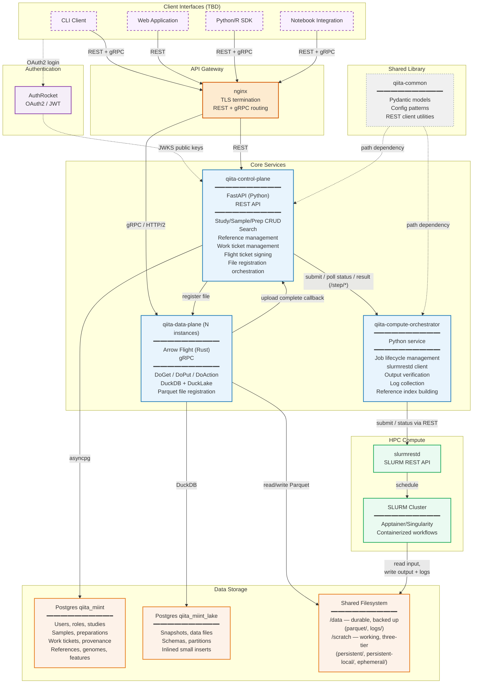

# System Overview

## System Architecture

**Legend:**
- **Solid lines** — runtime data/request flow
- **Dashed lines** — configuration/build-time dependencies
- **Purple dashed border** — Client interfaces (unresolved, to be discussed)

## Components

- **qiita-control-plane** — Client-facing REST API (Python 3.14, FastAPI, asyncpg, Postgres, dbmate, OpenAPI, PyTest, ruff, uv, GitHub Actions CI). Handles CRUD for study/sample/preparation, search, work ticket creation/management, and reference management (genome/feature/reference ID minting, reference membership, taxonomy authority registration). Signs Flight tickets (Ed25519, asymmetric) for client access to data plane. Orchestrates file registration in DuckLake (via data plane) after compute completion. Hosts the **workflow runner** (`qiita_control_plane.runner`) — for each work ticket, walks the action's `steps:` list, dispatching `action:` entries to in-process LIBRARY primitives and `step:` entries to the orchestrator over HTTP via the decoupled `submit` / `status` / `result` trio. The control plane drives the poll loop and persists per-step progress to `qiita.work_ticket_step`.
- **qiita-data-plane** — Data layer (Rust, arrow-flight, DuckDB v1.5.3, duckdb-miint extension, DuckLake w/ Postgres catalog). Arrow Flight protocol (gRPC-based). Intentionally "dumb" — select/insert/delete by exact integer identifiers. Clients connect directly through nginx. Verifies Ed25519-signed Flight tickets issued by the control plane (holds only the public key — it cannot forge tickets); performs no user authentication itself. Registers Parquet files into DuckLake via `ducklake_add_data_files` (metadata-only, no I/O). Runs as the dedicated `qiita-data` system user; verifies result file permissions before registration and rejects files that are not `440`. **Horizontally scalable**: each instance holds an independent DuckDB+DuckLake connection to the shared Postgres catalog; DuckLake's snapshot-isolated concurrent read model means multiple instances never block each other. nginx load-balances gRPC traffic across all instances.
- **qiita-compute-orchestrator** — Separate Python service for compute step execution. Exposes the decoupled `POST /api/v1/step/{submit,status,result}` trio (plus `POST /api/v1/step/find-by-name`) which the control-plane runner drives: `submit` `sbatch`es the job and returns a handle immediately, the CP polls `status` until terminal, then `result` verifies the output and returns it. The orchestrator is **stateless across these calls** — it owns no in-flight job state; the handle it returns carries everything (SLURM job id + workspace paths), and the CP persists it (so a CP restart can re-attach). SLURM jobs are truly dumb (read input, process, write output, exit). Also builds aligner indices for references (minimap2 `.mmi`, bowtie2) as SLURM batch jobs. Abstracts compute backend behind a clean `ComputeBackend` interface (`LocalBackend` for dev/test runs DuckDB+miint in-process; `SlurmBackend` is the production target). Has no direct DB access — the orchestrator only knows about identifiers it receives in `/step/*` requests.
- **qiita-common** — Shared Python library for control plane and compute orchestrator. Pydantic models (work ticket states, API request/response schemas), config patterns, and REST client utilities. Prevents drift between services' understanding of the API contract.
- **API gateway** — nginx: REST to qiita-control-plane, Arrow Flight/gRPC (HTTP/2+TLS) load-balanced across N qiita-data-plane instances.
- **Auth** — three principal kinds (human, service, anonymous). Humans authenticate via AuthRocket OIDC; services hold opaque PATs; CP↔DP traffic is Ed25519-signed Flight tickets. See [`docs/auth.md`](../auth.md) for the principal model, scopes, endpoints, and runbooks.
- **Client interfaces** — **[UNRESOLVED]** How users interact with Qiita. Placeholder candidates include: CLI tool, web application, Python/R SDK, and notebook integration. Details on which interfaces to build, their scope, and priorities are TBD. All client interfaces connect through nginx and authenticate via AuthRocket. REST-only clients interact with the control plane; clients needing bulk data transfer also use Arrow Flight (gRPC) to the data plane.
