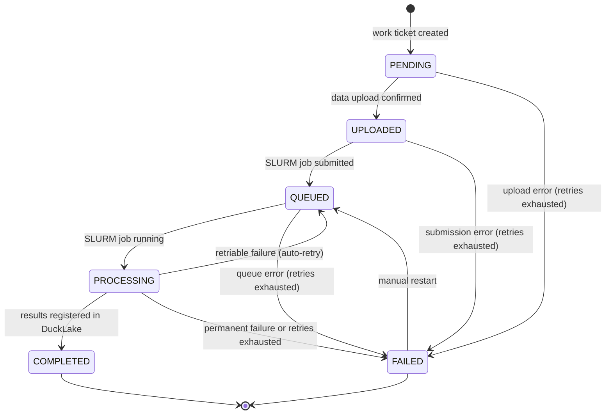

# Processing and Work Tickets

## Auth & Data Access Flow

See [`docs/auth.md`](../auth.md) for the principal model, login flow, scopes, endpoints, and runbooks.

## Data Upload & Processing Workflow

```mermaid
sequenceDiagram
    participant C as Client
    participant NX as nginx
    participant CP as Control Plane<br/>(FastAPI)
    participant CO as Compute<br/>Orchestrator
    participant SR as slurmrestd
    participant SL as SLURM Job<br/>(Container)
    participant DP as Data Plane<br/>(Arrow Flight)
    participant PG_APP as Postgres<br/>(qiita_miint)
    participant FS as Shared<br/>Filesystem

    Note over C,CP: 1. Upload request
    C->>NX: POST /upload + JWT
    NX->>CP: route REST
    CP->>PG_APP: mint upload row (pending)
    CP-->>C: upload_idx + signed Flight ticket for DoPut

    Note over C,DP: 2. Data upload
    C->>NX: DoPut(signed_ticket) + JWT + Arrow record-batch stream
    NX->>DP: route gRPC
    DP->>DP: verify JWT + ticket signature
    DP->>FS: write upload.parquet to PATH_SCRATCH/staging/uploads/<upload_idx>/
    DP-->>C: upload confirmed

    Note over C,CP: 3. Upload done, work ticket submitted
    C->>NX: POST /upload/{upload_idx}/done
    NX->>CP: route REST
    CP->>PG_APP: upload pending → ready
    C->>NX: POST /work-ticket (action_context names the upload_idx)
    NX->>CP: route REST
    CP->>PG_APP: create work ticket (PENDING)

    Note over CP,CO: 4. Compute submission (CP drives; CO stateless)
    CP->>CO: POST /step/submit (work ticket X, step entry)
    CO->>SR: POST /slurm/{slurmrestd_api_ver}/job/submit<br/>(container: qiita-workflow-amplicon:v1.2.0,<br/>input/output paths, stdout/stderr log paths)
    SR-->>CO: job_id=98765
    CO-->>CP: handle (slurm_job_id=98765, workspace paths)
    CP->>PG_APP: work_ticket_step (submitted, slurm_job_id=98765); ticket QUEUED

    Note over CP,SR: 5. Job monitoring (CP polls status_step)
    CP->>CO: POST /step/status (handle)
    CO->>SR: GET /slurm/{slurmrestd_api_ver}/job/98765
    SR-->>CO: state=RUNNING
    CO-->>CP: status=running
    CP->>PG_APP: work_ticket_step (running); ticket PROCESSING

    Note over SL,FS: 6. SLURM execution
    SL->>FS: read PATH_SCRATCH/staging/uploads/<upload_idx>/
    SL->>SL: run amplicon processing workflow
    SL->>FS: write PATH_SCRATCH/ticket/<work_ticket_idx>/<step>/attempt-<N>/output/ (mode 440)
    SL->>FS: stdout/stderr → PATH_SCRATCH/ticket/<work_ticket_idx>/<step>/attempt-<N>/logs/{stdout,stderr}

    Note over CP,CO: 7. Completion detection & file registration (CP-driven)
    CP->>CO: POST /step/status (handle)
    CO->>SR: GET /slurm/{slurmrestd_api_ver}/job/98765
    SR-->>CO: state=COMPLETED, exit_code=0
    CO-->>CP: status=completed
    CP->>CO: POST /step/result (handle, status)
    CO->>FS: verify output + manifest + mode 440, collect log paths
    CO-->>CP: outputs={manifest, ...}
    CP->>PG_APP: work_ticket_step (completed)
    CP->>DP: register file into DuckLake
    DP->>FS: move output into PATH_PERSISTENT/ducklake/<table>/<minted name>
    DP->>DP: CALL ducklake_add_data_files(catalog, T, path)<br/>(metadata only — no I/O, schema validated)
    DP-->>CP: file registered
    CP->>PG_APP: update work ticket (COMPLETED),<br/>record provenance + log paths

    Note over CP,CO: 7a. Failure handling (alternative)
    CP->>CO: POST /step/result (handle, status=failed)
    CO->>FS: collect launcher-failure line + log paths
    CO-->>CP: BackendFailure(kind, reason, exit_code=1)
    CP->>PG_APP: work_ticket_step (failed); increment retry_count,<br/>requeue if transient & retries < max_retries, else mark FAILED
```

**Text flow:**

1. **Upload request:** Client calls `POST /upload` with its JWT. The control plane mints a `qiita.upload` row (`pending`) and returns its `upload_idx` with a signed Flight ticket authorizing one DoPut.
2. **Data upload:** Client streams Arrow record batches to the data plane via Arrow Flight DoPut through nginx. The data plane verifies the JWT and ticket signature and writes `PATH_SCRATCH/staging/uploads/<upload_idx>/upload.parquet`.
3. **Upload done, work ticket submitted:** The client calls `POST /upload/{upload_idx}/done` (`pending` → `ready`); the data plane does not call back. The client then submits a work ticket whose `action_context` names the `upload_idx`; the runner resolves it to the staged file before the first step and marks the upload `consumed` after the workflow succeeds (`runner/_upload.py`).
4. **Compute submission:** Control plane calls `POST /step/submit`; the orchestrator `sbatch`es a SLURM job via slurmrestd. The job specifies a container image (e.g., `qiita-workflow-amplicon:v1.2.0`), input/output paths on the shared filesystem, and stdout/stderr log paths. SLURM jobs have no knowledge of the control plane — they are truly dumb (read input, process, write output, exit). The orchestrator returns a handle (SLURM job id + workspace paths) immediately; the CP persists it to `qiita.work_ticket_step` and updates the ticket to QUEUED. The orchestrator keeps no in-flight state.
5. **Job monitoring:** The control plane polls `POST /step/status` (the orchestrator does a single slurmrestd read per call) at its own cadence. When the job transitions to RUNNING, the CP records it on `work_ticket_step` and updates the ticket to PROCESSING. A CO-unreachable error here is transient and retried in place, never failing the ticket.
6. **SLURM execution:** The containerized workflow runs on the SLURM cluster, reading input from the staging path on the shared filesystem and writing Parquet results to the results path. Stdout/stderr are captured to log files on the shared filesystem.
7. **Completion detection & file registration:** When `status` reports terminal, the control plane calls `POST /step/result`; the orchestrator verifies the output + manifest, collects log file paths, and returns the outputs. Control plane validates the work ticket state, then instructs the data plane to register the Parquet file into DuckLake via `ducklake_add_data_files` (metadata-only operation — no I/O, only schema validation). On success, the control plane updates the work ticket to COMPLETED and records provenance (who, what, when, which workflow version, SLURM job ID, log paths).
7a. **Failure handling:** If the SLURM job ends terminal-but-failed, `result_step` raises a classified `BackendFailure` (kind, reason, log paths). The control plane records the failed attempt on `work_ticket_step` and increments the retry count. If the kind is transient and retries remain, it requeues (back to QUEUED) as a new attempt. If permanent or max retries are exhausted, it marks the work ticket as FAILED with the failure reason, stage, and log paths for diagnosis.

## Work Ticket Lifecycle



States:
- **PENDING** — work ticket created, awaiting data upload
- **UPLOADED** — raw data on shared filesystem, awaiting compute submission
- **QUEUED** — SLURM job submitted, waiting for cluster resources (slurm_job_id recorded)
- **PROCESSING** — SLURM job actively running on cluster
- **COMPLETED** — results registered in DuckLake, provenance recorded
- **FAILED** — failure at any stage, retries exhausted or permanent failure

Work ticket fields (per `qiita.work_ticket` migration `20260504000001_work_ticket.sql`):
- `work_ticket_idx` — primary key
- `action_id`, `action_version` — FK into `qiita.action`; pin the exact action definition this ticket was submitted against
- `originator_principal_idx` — submitter; FK into `qiita.principal`
- `scope_target_kind` plus one of `(study_idx, prep_idx)` or `reference_idx` — tagged-union scope target, governed by the `work_ticket_scope_target_consistent` CHECK
- `action_context` — JSONB validated at submission against `action.context_schema`
- `state` — `pending` / `queued` / `processing` / `completed` / `failed`
- `retry_count` — number of retry attempts so far (incremented on each PROCESSING → QUEUED retry)
- `max_retries` — per-ticket retry budget (default 3, max 100)
- `failure_type` — `retriable` or `permanent`; non-NULL on FAILED, NULL otherwise (CHECK enforced)
- `failure_stage` — coarse stage enum: `submission` / `step_run` / `finalize`
- `failure_step_name` — YAML step name when `failure_stage = step_run`; NULL otherwise (CHECK enforced)
- `failure_reason` — human-readable explanation
- `created_at`, `updated_at` — timestamps

The schema does not carry per-step provenance fields (slurm_job_id, log paths, current_step / total_steps, provenance JSONB, completed_at). The runner is synchronous and waits inline for each step; SLURM-side log retrieval is on the orchestrator and not surfaced on the work_ticket row.

Failure classification is finer-grained at the backend layer: `BackendFailure.kind` is one of the values in `qiita_common.backend_failure.FailureKind` (NODE_FAIL, OOM_KILLED, PREEMPTED, TIMEOUT_BEFORE_START, TRANSIENT_FS_ERROR, SLURMRESTD_UNREACHABLE, PROCESS_RESTARTED for retriable; BAD_INPUT, EXIT_NONZERO, CONTRACT_VIOLATION, UNKNOWN_PERMANENT for permanent). The runner collapses these to the two-valued `failure_type` for storage; `failure_reason` carries the kind name + per-failure detail for triage.

Retry semantics (implemented in `qiita_control_plane.runner._run_entry_with_retry`):
- On `BackendFailure(transient=True)` and `retry_count < max_retries`: bump `retry_count`, atomically transition `PROCESSING → QUEUED → PROCESSING`, retry the same entry. Earlier successful entries are not re-run — `bound` outputs carry forward.
- On `BackendFailure(transient=True)` with retries exhausted: transition to `FAILED` with `failure_type=retriable` (so post-mortems can distinguish "exhausted retries on a transient kind" from "permanent on first attempt").
- On `BackendFailure(transient=False)`: skip the retry loop, transition straight to `FAILED` with `failure_type=permanent`.
- On any other unwrapped `Exception` (LIBRARY primitive raising plain Python, programming bug): treat as `permanent`, `failure_type=permanent`, `failure_reason="<ExceptionType>: <message>"` truncated to 2000 chars.

Manual restart (`POST /api/v1/work-ticket/{idx}/run` on a `FAILED` ticket):
- Atomic UPDATE: state ← PENDING, `retry_count = 0`, all `failure_*` columns ← NULL (the DB CHECK requires `failure_*` all-NULL when state ≠ failed; the route clears them in one statement).
- Triggers a fresh in-process dispatch via `schedule_dispatch`, which queues behind the process-wide dispatch cap below when all slots are held. The original FAILED-row state is not preserved on the row itself; ops dashboards that want post-mortem retention should snapshot the `failure_*` fields before triggering /run.

**Dispatch concurrency.** Every dispatch path (route submit, ENA batch submit, startup reconcile, fan-out pump release) goes through `schedule_dispatch`, whose task holds one slot of the process-wide `_DISPATCH_CONCURRENCY` cap (8) for its whole workflow — an hours-long download poll included. Tasks past the cap queue FIFO and start as slots free, logging `queued behind the dispatch cap` when they start waiting and `dispatched after waiting` when they get one; nothing fails while it waits. Bounding in-flight workflows, not just connections, is the deliberate consequence: it is what keeps a burst of submits from pressuring the connection pool after `_STUDY_CONCURRENCY`'s permit has already been released at submit. Two behaviours follow that an operator should expect: a restart with more than 8 tickets in flight re-attaches the first 8 and queues the rest, and `/run` queues behind the same slots as ordinary submits. The cap is sized against the pool and `FANOUT_MAX_INFLIGHT` together — see the note on the constant.

**Single-CP-process contract.** The control plane runs as a single
`qiita-control-plane.service` instance. Dispatch tasks are bound to the
asyncio loop of the process that submitted them; a CP restart loses
those tasks. To recover, the lifespan startup hook calls
`reconcile_inflight_tickets`, which **re-attaches** rather than fails:
for every non-terminal (PENDING / QUEUED / PROCESSING) ticket it schedules
`run_workflow(resume=True)`, which fast-forwards entries a prior run already
completed (rebuilding their `bound` outputs from the shared workspace),
re-attaches a still-running SLURM job by its persisted `slurm_job_id` (or
adopts an orphan by its deterministic name via `find-by-name`), finalizes a
job that succeeded during the outage, and decides a purged job from its
on-disk output manifest. This is the deliberate consequence of deploys
stopping/starting CP+CO without draining — a restart with live in-flight
work is routine, so it must never nuke running jobs (the pre-decoupling
`recover_orphaned_tickets` blanket-failed them). The reconcile assumes no
other CP process is concurrently dispatching; a CP HA topology requires
fencing it (per-process owner column or advisory lock) before lifting that
restriction.

## ENA Study Import

Admin-facing bulk import of public INSDC studies' metadata and reads, distinct
from a workflow entry: `POST /api/v1/ena-import-batch` takes a list of study
accessions and returns immediately with a batch handle, while a background task
(`qiita_control_plane.ena_import.batch`) resolves each accession's metadata (via
`duckdb-miint`'s `read_ena` / `read_ena_attributes`), registers it into
`study`/`biosample`/`sequenced_sample` rows (de-duplicating biosamples that share
an ENA sample accession across studies), and submits one `download-ena-study`
work ticket per `sequenced_pool` holding the study's runs (a re-import's new runs
get a new pool once an earlier pool's download is under way). That ticket then
runs like any other workflow: a native `ingest_ena_reads` step (`read_ena_sequences`
+ the same mint-then-sort-and-assign pipeline `ingest_reads` uses) followed by the
standard `register-files` action into DuckLake. One accession's failure — resolver
error, unmappable platform, a DB conflict — is isolated to that accession; it never
aborts the batch or its siblings. See
[`docs/runbooks/ena-import.md`](../runbooks/ena-import.md) for the operator-facing
walkthrough, the REST surface, and this surface's hard scope limits (INSDC only,
`http` transport only, no DDBJ/legacy-platform or ENVO harmonization yet).

## Compute Orchestrator

Separate Python service responsible for the full compute job lifecycle. SLURM-backend operational setup — cluster prerequisites, identity model, the `qiita-job` JWT auto-refresh timer — lives in [`docs/runbooks/slurm-backend-setup.md`](../runbooks/slurm-backend-setup.md).

**Lifecycle ownership (decoupled).** The orchestrator is a stateless pass-through over three calls: `submit_step` `sbatch`es the job and returns a handle (SLURM job id + workspace paths); `status_step` is a single non-looping slurmrestd read; `result_step` verifies the output and returns it (or raises a classified `BackendFailure`). The **control plane** owns the poll loop between submit and result — it polls `status_step` at its own cadence (a ~10s constant) and persists per-step progress to `qiita.work_ticket_step`, so a long job never holds the CP→CO connection open and a CP restart can re-attach. A CO-unreachable error (transport / HTTP 5xx) during any of the three is transient and retried in place, never failing the ticket. SLURM jobs have no knowledge of the control plane — they are truly dumb (read input, process, write output, exit). As their final act before exiting, jobs must `chmod 440` all output files and write a manifest (see Container Contract below). The orchestrator checks the mode after the job exits (gate 3 of the output verification); the data plane does not check it when it registers a file.

**Multi-step workflows:** Workflows consist of one or more sequential steps, each with independent resource requirements and a step type of `map` or `reduce`. Steps are submitted as separate SLURM jobs so each is sized for its actual resource needs.

**Step types:**

- **`map`** — sample-independent. The orchestrator fans out one SLURM job per `prep_sample_idx` in parallel. Each job receives a `params.json` containing the full identifier set for that sample plus processing parameters, and produces a single-sample Parquet to its own output directory. Map jobs are retried independently — a failed sample is retried without reprocessing survivors. `failed_samples` on the work ticket accumulates any `prep_sample_idx` values that exhaust retries.
- **`reduce`** — submission-level (all surviving prep_samples for one processing). Executes once all map jobs for the preceding step have completed. Receives all surviving map output directories as its input. Must produce a single Parquet sorted by `(prep_sample_idx, processing_idx, processed_prep_sample_idx)`. Two reducer implementations:
  - **`platform/sort-merge`**: generic platform-provided container — DuckDB reads all input Parquet files, sorts by the standard identifier columns, writes output. No workflow-specific code required for pure aggregation.
  - **workflow-specific**: custom container for cross-sample computation (normalisation, diversity metrics, etc.). Must still output sorted by the standard identifier columns as part of the container contract.

Execution (the CP runner drives the per-step loop — `submit_step` → poll `status_step` → `result_step`; the orchestrator's `submit_step` lays out `params.json` and `sbatch`es, and map/reduce fan-out is a planned extension of the single-job-per-step backend):

1. For each `map` step: write per-sample `params.json`, fan out N SLURM jobs (one per `prep_sample_idx`), the CP polls each to terminal, retry failed samples independently, accumulate `failed_samples`
2. For each `reduce` step: write `params.json` containing the expected `processed_prep_sample_idx` set for surviving samples, submit one SLURM job with all map output directories as input, the CP polls to completion
3. Verify three-gate output for every job (map and reduce)
4. Advance `current_step` on the work ticket and continue
5. After the final step, call back to the control plane to trigger data plane registration

Step outputs, intermediate and final, land in the step's per-attempt workspace, `PATH_SCRATCH/ticket/<work_ticket_idx>/<step>/attempt-<N>/` (see [Data Storage](storage.md#data-storage)). Jobs never write into the lake: registration has the data plane move each registered file from there into `PATH_PERSISTENT/ducklake/<table>/` and then call `ducklake_add_data_files`.

Failure records which step failed (`failed_stage=processing_step_{n}`). Manual restart resets to step 0.

**Container contract:** Every workflow container must honour this interface regardless of what it does internally. Violations are rejected by the orchestrator's output verification gates and treated as permanent failures.

Inputs (orchestrator provides before submission):
- `QIITA_INPUT_PATH` env var — directory to read input from
- `QIITA_OUTPUT_PATH` env var — directory to write output to
- `$QIITA_INPUT_PATH/params.json` — written by the orchestrator; absent if the step has no parameters

For `map` steps, `params.json` contains the sample's full identifier set and processing parameters:
```json
{
  "prep_sample_idx": 42, "processing_idx": 10, "processed_prep_sample_idx": 99,
  "parameters": { }
}
```

For `reduce` steps, `params.json` contains the processing identifier, the surviving sample set, and any parameters:
```json
{
  "processing_idx": 10,
  "surviving_samples": [
    {"prep_sample_idx": 42, "processed_prep_sample_idx": 99}
  ],
  "parameters": { }
}
```

Outputs (container must produce):
- All output files written to `$QIITA_OUTPUT_PATH`
- `$QIITA_OUTPUT_PATH/manifest.json` written as the final act before chmod, with two fields:
  ```json
  {
    "files": [{"path": "output.parquet", "size_bytes": 12345678}],
    "outputs": {"manifest": "output.parquet"}
  }
  ```
  `files` is the audit list — every file the container wrote, with declared sizes for the verifier to check. `outputs` maps the YAML step's declared `outputs:` names to relative paths under `$QIITA_OUTPUT_PATH`; use `"."` for an output that IS the directory (e.g. a step whose output is `staging_dir`).
- All files in `$QIITA_OUTPUT_PATH` set to `chmod 440` (including the manifest)
- Exit code 0 on success, non-zero on any failure

The container must not read from anywhere other than `$QIITA_INPUT_PATH`, must not write to anywhere other than `$QIITA_OUTPUT_PATH`, and must have no knowledge of Qiita, the control plane, or any service credentials.

Orchestrator verification gates (all must pass before a step is accepted):
1. Exit code 0
2. `$QIITA_OUTPUT_PATH/manifest.json` exists, parses as JSON, has both `files` and `outputs` keys
3. Every file listed in `files` exists at its declared `size_bytes`
4. The `outputs` map's relative paths resolve under `$QIITA_OUTPUT_PATH` (no traversal) and exist
5. Every file under `$QIITA_OUTPUT_PATH` is mode `0o440` and is listed in `files` (no extras)

A gate failure after exit code 0 is a permanent failure — the container returned 0 but didn't honor the contract, so retry won't help. SlurmBackend wraps the resulting failures as `BackendFailure(kind=CONTRACT_VIOLATION, transient=False)`.

**The same contract applies to native (`module:`) steps.** A native job returns a `dict[str, Path]`; the shared SLURM launcher (`jobs/__main__.py`) writes the manifest and chmods on the job's behalf, and the verifier gates it identically. Gate 4 has a consequence that is easy to trip over: **a declared step output must resolve under `$QIITA_OUTPUT_PATH`**, so a *persistent* artifact a job writes outside the per-attempt workspace — e.g. a host-filter index under `PATH_DERIVED` (see "Aligner Index Storage") — **cannot be a step output**. Record its location in an in-tree meta JSON instead (the consuming action reads `fs_path` from it, as `register-index` does for the rype/minimap2 indexes); the launcher rejects an out-of-tree output as a `CONTRACT_VIOLATION`. Note this only bites under SLURM: `LocalBackend` runs the job in-process and returns the dict directly without writing or verifying a manifest, so a bad output binding passes every local/unit test and only fails on a real submission.

**Primary backend:** SLURM via slurmrestd REST API (JWT auth).
- Submits jobs as JSON (no `#SBATCH` directives — slurmrestd ignores them)
- Environment variables explicitly specified in submission payload
- Polls job status via `GET /slurm/{slurmrestd_api_ver}/job/{job_id}` (version is a config parameter; target SLURM ≥ 25.x.x)
- Runs output verification gates on completion
- Reports results back to control plane via REST callback after all steps pass
- Shared filesystem assumed for all data I/O

**Job logging:** SLURM captures stdout/stderr to `logs/stdout` and `logs/stderr` in the step attempt's workspace, `PATH_SCRATCH/ticket/<work_ticket_idx>/<step>/attempt-<N>/`. The path is derived from the workspace, not stored on the ticket; `GET /work-ticket/{idx}/step/{step_index}/logs` (`qiita ticket logs`) serves a bounded tail.

**Workflow containerization:** Apptainer/Singularity for HPC compatibility. (Apptainer is the Linux Foundation continuation of Singularity; the `singularity` command is typically aliased to `apptainer`.)
- Container images per workflow step, versioned (e.g., `qiita-workflow-amplicon:v1.2.0`)
- Workflow definitions in monorepo as config: ordered steps, each with container image, entrypoint, and resource requirements
- No root required (runs unprivileged)
- SLURM submits via `srun apptainer exec` or native integration

**Workflow runtimes (`container:` vs `module:`).** Each `step:` entry in a workflow YAML declares exactly one of two runtimes. `container:` names an apptainer image; the SBATCH script invokes `apptainer exec <image> [entrypoint]`. `module:` names a Python module path under `qiita_compute_orchestrator.jobs.*`; the SBATCH script invokes `srun python -m qiita_compute_orchestrator.jobs --job <short_name>` against the orchestrator's installed Python environment on the compute node. Native steps are the right choice when a step's only dependencies are already in `qiita-compute-orchestrator`'s `pyproject.toml`; container steps are required when the step pulls in heavier bioinformatics deps or system packages.

Every native job module exports exactly two symbols: a `class Inputs(BaseModel)` declaring its typed input contract, and `async def execute(inputs, workspace) -> dict[str, Path]` doing the work. A single framework dispatcher (`run_native_job` in `jobs/__init__.py`) imports the module, validates `raw_inputs` against `mod.Inputs`, invokes `execute`, and maps known exceptions (`NotImplementedError`, `FileNotFoundError`, `ValueError`, `ValidationError`) to typed `BackendFailure` values. Both `LocalBackend` and the shared SLURM launcher (`jobs/__main__.py`) route through `run_native_job`, so a job sees identical inputs and identical failure classification regardless of runtime.

The wire validator on `StepSubmitRequest` is shape-only — it enforces exactly-one(`container`, `module`) but does not check the prefix. The native-job module prefix (`qiita_compute_orchestrator.jobs.`) itself is enforced at four other sites: sync (control plane refuses to persist a YAML whose `module:` is outside the prefix), submit (the `/step/submit` route handler checks before invoking the backend), boot (the orchestrator's lifespan scan walks `jobs/` and refuses to start if any submodule fails the `Inputs`/`execute` contract), and dispatcher (`run_native_job` re-validates so direct in-process callers can't bypass the check). The `slurm/contract.py` module holds the two constants the producer (container entrypoint or native launcher) and the verifier (`slurm/verify.py`) both depend on — `EXPECTED_FILE_MODE = 0o440` and `MANIFEST_FILENAME = "manifest.json"`.

**Backend code-sharing:** Both `LocalBackend` (DuckDB+miint in-process) and `SlurmBackend` (submits jobs via slurmrestd) are wired. Each implements the same `submit_step` / `status_step` / `result_step` / `find_jobs_by_name` interface: SlurmBackend submits + classifies + verifies (the CP owns the poll loop between submit and result); LocalBackend is synchronous — `submit_step` runs the module in-process and returns a terminal handle carrying the outputs, with no fake job id. For container steps, the work each step performs lives in LocalBackend's per-step helpers (`_run_hash`, `_run_load`, the module-level `_write_*` builders) — the source of truth for that family of steps until those helpers fold into the `jobs/` package. For native steps, both backends route through `run_native_job` and the work lives in the job module itself, so the dev/test path and the production SLURM path share the same code regardless of runtime.

**Future:** Clean `ComputeBackend` interface allows adding alternative backends (cloud, Kubernetes) without changing the control plane.

## Health Checks

Each service exposes a health check endpoint for monitoring and deployment verification.

- **qiita-control-plane:** `GET /health` — aggregated. Probes the CP's own Postgres pool (`SELECT 1`), the orchestrator's `GET /health` over HTTP, and the data plane's `grpc.health.v1.Health/Check` over gRPC, in parallel with per-probe ~1s timeouts. Returns the legacy `{"status": ..., "service": "qiita-control-plane"}` shape plus an optional `services: {"cp": ..., "co": ..., "dp": ...}` per-service breakdown. The top-level `status` is the strict aggregate (`ok` iff every configured service is `ok`; any non-`ok` configured service demotes to `degraded`). Cached for ~5s with single-flight lock semantics so a landing-page traffic spike doesn't dogpile downstream probes.
- **qiita-data-plane:** gRPC health check protocol (`grpc.health.v1.Health/Check`) via `tonic-health` — process-liveness only (returns `SERVING` once the server has bound its port). Does not probe DuckLake catalog connectivity. `tonic-reflection` is also registered (both v1 and v1alpha) so `grpcurl` can introspect the service from `make verify-health` without a local proto.
- **qiita-compute-orchestrator:** `GET /health` — process-liveness only (returns `{"status": "ok", "service": "qiita-compute-orchestrator"}` once the FastAPI app has started). Does not probe slurmrestd reachability today; a real downstream probe is tracked as a follow-up.
- **nginx:** proxies health checks; can be used for readiness gating during deploys

## Work Ticket Queue

Postgres-based (`SELECT ... FOR UPDATE SKIP LOCKED`). Work tickets created by qiita-control-plane. Work ticket state transitions driven by callbacks from data plane and compute orchestrator.
