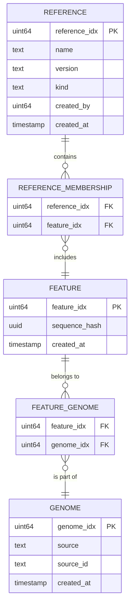

# Reference Database Design

Reference databases — curated collections of sequences, taxonomies, annotations, and phylogenies — are central to alignment-based analyses. The reference design uses a three-level identity model to decouple individual sequences from the logical genomes they belong to and the versioned reference collections they appear in.

## Three-Level Identity Model



The three levels:

- **`reference_idx`** — a versioned reference collection. Each `(name, version)` pair gets a unique `reference_idx`. The `kind` field distinguishes sequence references (`sequence_reference`) from taxonomy authorities (`taxonomy_authority`). Examples: Greengenes2 2024.09, WoL3 v1.0, RS225, NCBI Taxonomy 2025-03.
- **`genome_idx`** — a logical genome that persists across references. When the same genome appears in WoL3 and RS225, both link to the same `genome_idx`, enabling cross-reference queries ("is this the same genome in WoL3 and RS225?"). Not all features are genomes — `genome_idx` is nullable for features like full-length 16S records or ASVs that have no corresponding genome. Carries provenance via `source` (genbank, refseq, collaborator, qiita) and `source_id` (external accession when applicable).
- **`feature_idx`** — a specific sequence, deduplicated by MD5 hash (computed by DuckDB's `md5()` on sequences read via miint). Identical bytes always resolve to the same `feature_idx`. A genome is composed of one or more features (one per contig/chromosome) — there is no genome linearization. Alignments and annotations use coordinates relative to a `feature_idx`.

Junction tables:

| Table | Key | Purpose |
|---|---|---|
| `reference_membership` | `(reference_idx, feature_idx)` | Which features belong to which reference version |
| `feature_genome` | `(feature_idx, genome_idx)` | Which genome(s) a feature belongs to — many-to-many: not all features have a genome, and one feature can belong to several genomes (a plasmid shared across organisms shares one content-hash `feature_idx`) |

**Tip-to-feature is not one of them.** A phylogeny tip's `feature_idx` is a **column on the DuckLake `reference_phylogeny` row**, not a Postgres junction table — the migration that created this schema says so explicitly (`db/migrations/20260501000003_reference.sql`). See [Phylogeny and Placements](#phylogeny-and-placements).

A feature may belong to multiple references (e.g., the same contig in WoL3 and RS225). A genome may contain multiple features (e.g., a multi-contig assembly). A feature may also belong to multiple genomes: two organisms sharing an identical mobile element (a plasmid) resolve to one content-hash `feature_idx` under both `genome_idx` (`feature_genome` is a true many-to-many — the composite PK `(feature_idx, genome_idx)`, no standalone `UNIQUE(feature_idx)`). MD5-based deduplication ensures that if two references include the same sequence bytes, they share one `feature_idx` — no data is duplicated.

## Control Plane vs. Data Plane Split

All ID minting and membership management lives in the control plane (Postgres OLTP). Bulk sequence data, taxonomy, annotations, phylogeny, and analysis results live in the data plane (DuckLake OLAP).

**Control plane (`qiita_miint`):**

| Table | Key columns | Purpose |
|---|---|---|
| `reference` | `reference_idx` PK | Reference-level metadata: name, version, kind, `is_host`, status, creator, timestamps. `is_host` is orthogonal to `kind` — a host reference is still a `sequence_reference` but is used for host-read depletion (see [Host references](#host-references)) |
| `host_filter_profile` | `idx` PK, `UNIQUE(host_term_idx, platform)` | The `(host taxon, platform) → reference build(s)` map that resolves *which organism* (biosample metadata) to *which build* (submission-time config). `host_term_idx` → an NCBI Taxonomy `terminology_term`; `platform` → `qiita.platform`; `rype_reference_idx` (NOT NULL) + `minimap2_reference_idx` (nullable, no second stage when NULL) → `reference`, both `ON DELETE RESTRICT`. Empty until seeded per-deploy. See [Host-filter resolution](#host-filter-resolution) |
| `genome` | `genome_idx` PK | Genome provenance: source, source_id, timestamps |
| `feature` | `feature_idx` PK | Feature identity: sequence_hash, timestamps |
| `reference_membership` | `(reference_idx, feature_idx)` | Which features are in each reference version. `shard_id` (nullable `INTEGER`, `>= 0` CHECK) records the shard planner's assignment for a sharded *analysis* reference — the lineage-sorted shard index (0..N-1) the feature belongs to; NULL = unassigned (unsharded reference, e.g. a host reference, or a deferred/no-genome feature). `accession` (nullable `TEXT`) is the representative FASTA-header record accession (`read_id`) per feature — `feature` is content-hash-global so the per-`(reference, feature)` accession lives here; surfaced by the reference-exclusion query endpoint as external provenance |
| `feature_genome` | `(feature_idx, genome_idx)` | Feature-to-genome mapping |
| `reference_index` | `reference_index_idx` PK, `reference_idx` FK | Built search indexes for a reference: `(index_type, fs_path, params JSONB, created_at, shard_id)`. No `UNIQUE(reference_idx, index_type)` — "growing" a reference appends a newer generation, newest wins. Today `index_type` ∈ {`rype` (the host-filter `.ryxdi` minimizer index), `rype_router` (the whole-reference multi-bucket routing `.ryxdi`), `minimap2` (the `.mmi`), `bowtie2` (the `.bt2` subject set)} — `minimap2` is dual-purpose (host-filter *and* per-shard analysis), `rype` is host-filter only, `rype_router` and `bowtie2` are analysis-alignment only (all three deliberately absent from `HOST_FILTER_REQUIRED_INDEX_TYPES`); the type is plain TEXT+CHECK, so a new index type is a one-line CHECK migration. `shard_id` (nullable `INTEGER`, `>= 0` CHECK) discriminates a per-shard *analysis* index (one row per shard, `shard_id` 0..N-1 — `minimap2`/`bowtie2`) from a whole-reference index (host `rype`/`minimap2`, or the `rype_router`; `shard_id` NULL); no `shard_count` column (it's `COUNT(*)` per `(reference_idx, index_type)`) |

**Data plane (DuckLake):**

| Table | Sort / partition key | Contents |
|---|---|---|
| Reference sequences | `feature_idx` | `(feature_idx, sequence, sequence_hash, length)` |
| Reference taxonomy | `(reference_idx, feature_idx)` | Taxonomy assignments — reference-version-specific. Rank columns (domain through species) plus `ncbi_taxon_id` when available |
| Reference annotations | `(parent_feature_idx, position)` | GFF-like: `(annotation_idx, reference_idx, feature_idx, parent_feature_idx, annotation_id, source, annotation_type, position, stop_position, strand, score, phase, attributes)` — gene models, CDS, regulatory regions. `feature_idx` is the interval's OWN feature (its extracted bytes); `position` / `stop_position` are windows on `parent_feature_idx`'s sequence |
| Reference phylogeny | `(reference_idx, node_index)` | Per-reference tree: `(reference_idx, node_index, name, branch_length, edge_id, parent_index, is_tip)` — Newick trees decomposed into node tables via `read_newick` |
| Placements | `(reference_idx, fragment)` | jplace data stored as-is via `read_jplace`; reconciled against reference membership and phylogeny at query time |
| `alignment` | `(alignment_idx, prep_sample_idx, sequence_idx, feature_idx, position)` | Per-read sharded-alignment results, keyed by the mask-style `alignment_idx` (NOT `processing_idx` — that hierarchy is deferred): 5 CP identity columns (`alignment_idx, prep_sample_idx, sequence_idx, feature_idx, mate_feature_idx`) + the miint aligner output **minus** the raw VARCHAR subject ids `reference`/`mate_reference` (their identity is carried by `feature_idx`/`mate_feature_idx`): `flags, position, …, tag_sa`. Created by `ensure_alignment_tables`; a **sink** — not in `ALLOWED_TABLES` (no Flight read-side yet) |
| `assembled_sequence` / `assembled_sequence_chunks` | `feature_idx` | One assembly run's contigs, content-hash deduped into the shared feature space exactly like a reference sequence: `(feature_idx, sequence_hash, sequence_length_bp)` plus the bytes in 64 KB chunks. Both are in `ALLOWED_TABLES`, scoped to one `(prep_sample_idx, processing_idx)` run (`POST /assembly/ticket/doget`) — neither carries `prep_sample_idx`, so `build_assembly_run_query` resolves the run through `assembly_membership` as a semi join, the same shape a `reference_idx` filter takes on the reference tables |
| `assembly_membership` / `bin_quality` | `(prep_sample_idx, processing_idx)` | Which features a `(prep_sample, run)` assembly contains and in which bin, and per-subject CheckM quality (MAG, LCG, and the unbinned residue above a length cut; a shorter unbinned contig has an `assembly_membership` row and no `bin_quality` row, so the two join LEFT). The DuckLake copies, for bulk joins against the sequences. `assembly_membership` is a **sink** — absent from `ALLOWED_TABLES`, not nameable by a ticket, read by the data plane only as the assembly surfaces' scope resolver (above) and never streamed. `bin_quality` IS in `ALLOWED_TABLES`, scoped by `build_bin_quality_query` to one run over a cohort and signed by no route — the feature-table resolver mints its ticket in-process to attach CheckM scores to the genomes it stages |
| Count / aggregation *(planned)* | `(prep_sample_idx, …, feature_idx)` | Sparse COO format: `(prep_sample_idx, processing_idx, processed_prep_sample_idx, feature_idx, value)` |

The **`alignment`** table is created by the data plane (`ensure_alignment_tables`) and is keyed by `alignment_idx` — the formal `processing_idx` / `processed_prep_sample_idx` hierarchy remains deferred (see "alignment consumer"). The **Count / aggregation** row still describes a planned processing-results layout not yet created by the data plane; `ensure_read_tables`/`ensure_reference_tables`/`ensure_alignment_tables`/`ensure_assembly_tables` create the reference, read, alignment, and assembly tables today.

## Taxonomy as a Reference

NCBI Taxonomy (and similar taxonomy authority systems) are modeled as references with `kind = 'taxonomy_authority'`. This means:

- An NCBI Taxonomy release gets its own `reference_idx`, just like any sequence reference
- Taxonomy versions are tracked with the same machinery as sequence reference versions
- If GTDB, Silva, or other taxonomy systems are added, they are additional taxonomy authority references — no special-case code

A genome or feature may have taxonomy assignments from multiple sources (e.g., both a sequence reference's taxonomy and the NCBI taxonomy authority). Both are rows in the taxonomy table keyed on `(reference_idx, feature_idx)` — the `reference_idx` distinguishes the source. The `ncbi_taxon_id` column is stored alongside the rank strings for features that have an NCBI assignment, enabling joins to external NCBI data.

## Annotations

Functional annotations (gene models, CDS, regulatory features) follow a GFF3-compatible schema in the data plane, parsed via the miint `read_gff` table function. Annotations are keyed on `(feature_idx, position)` — they describe coordinates on a specific sequence.

Non-taxonomic annotation systems (KEGG, COG, Pfam) are normalized under the GFF schema where feasible, using the `source` and `type` columns to distinguish annotation origins and the `attributes` MAP for system-specific metadata.

## Phylogeny and Placements

Reference phylogenies are stored as node tables decomposed from Newick files via the miint `read_newick` table function. Each tree is keyed on `reference_idx` and contains `(node_index, name, branch_length, edge_id, parent_index, is_tip)` per node. The miint internal phylogeny data model is compatible with this schema.

**Tip-to-feature mapping:** a tip row carries its own **`feature_idx` column**; internal nodes carry NULL. There is no junction table and none is planned — the mapping lives in DuckLake beside the topology, which is what the reference migration chose (`db/migrations/20260501000003_reference.sql`). It is populated at load by matching Newick tip names against the reference's sequence `read_id`s, with a LEFT JOIN so a tip that matches nothing keeps its row with a NULL `feature_idx` (`jobs/reference_load.py`'s `_write_phylogeny`). Phylogeny-rooted queries therefore stay inside one lake table: traverse `parent_index` to collect descendant tips, read their `feature_idx` directly, and go from there to alignment/count tables. Internal nodes are addressed by `(reference_idx, node_index)` — they have no global identifier and are not referenced across trees.

**There is no exclusion-aware `reference_phylogeny_visible` view**, unlike sequences and taxonomy, and the reason is structural: a tree is not row-independent, so anti-joining a blocked tip's row would orphan its internal parents and malform the topology. The contract is that a consumer **shears** the tree to its keep-set instead (`qiita-data-plane/src/ducklake.rs`, `ensure_exclusion_tables`); see *Reference exclusion* below for who does that today.

Phylogenetic placements (jplace format) are stored as raw placement data via `read_jplace` rather than resolved into the tree. Reconciliation of placements against the reference phylogeny happens at processing time or on user queries, keeping the stored data independent of tree topology changes.

## Reference exclusion (curated blocklist)

Some loaded reference data is bad — a contaminated genome, a mislabelled contig. Rather than delete rows or rebuild aligner indexes, a bad `genome_idx` or `feature_idx` is **masked at consumption**: it stays in the built indexes (and still consumes compute), but it is dropped from downstream products before any rollup. This mirrors the `read`/`read_mask`/`read_masked` pattern — a base table is never read directly, only through a policy surface — with the polarity **inverted**: `read_mask` is a per-row compute output that *includes* on `reason='pass'`; an exclusion is a tiny hand-curated *blocklist* consumed by an **anti-join** (cheap in DuckDB). There is no `mask_sample`-style completion gate — the absence of an exclusion row safely means "not blocked."

The blocklist is **global** and authoritative in Postgres (`qiita.reference_exclusion`, keyed on `genome_idx` XOR `feature_idx` — no `reference_idx`, so future references that re-load a blocked genome inherit the block). It is mirrored to a small DuckLake table (`qiita_lake.reference_exclusion(feature_idx)`) that holds the **resolved** feature set: direct feature blocks ∪ every feature of a blocked genome (via `feature_genome`). Two `CREATE OR REPLACE VIEW … _visible` views anti-join that mirror:

```
alignment_visible          = alignment          ANTI JOIN reference_exclusion USING (feature_idx)
reference_taxonomy_visible = reference_taxonomy  ANTI JOIN reference_exclusion USING (feature_idx)
```

The raw `alignment` / `reference_taxonomy` tables are **removed from both DoGet allowlists** (`flight_service.rs::ALLOWED_TABLES` and `routes/reference.py::_DOGET_ALLOWED_TABLES`), so only the `_visible` views are Flight-reachable — the `read_masked`-style unbypassability guarantee, enforced by a CP↔Rust allowlist parity test. Every DoGet consumer (the OGU feature-table alignment ticket, `plan_shards`' taxonomy ticket) reads the view; `register-files` still *writes* the raw base tables (a DoAction, not a read). Because alignment carries `feature_idx` but not `reference_idx`, anti-joining `alignment_visible` drops a blocked genome's rows before any OGU/coverage rollup, and `woltka_ogu` renormalizes over the survivors — so feature tables are corrected immediately with existing data left intact and no index rebuild.

The Postgres→DuckLake mirror is refreshed by a **wholesale idempotent REPLACE** DoAction (`sync_reference_exclusion`: `DELETE` then `INSERT … SELECT feature_idx FROM read_parquet(<dest>)`), in `REPLAY_SAFE_ACTIONS`. The control plane re-resolves the whole blocklist and re-materializes it (a) on **every blocklist mutation** (the admin route), (b) as the **post-load `sync-reference-exclusion` tail step** of every reference-load workflow (`reference-add`, `local-reference-add`, `host-reference-add`, `local-host-reference-add`) — a fresh assembly of an already-blocked genome mints new `feature_idx` the standing mirror can't know about, which the full re-resolve then catches (a genome re-loaded with identical bytes reuses the already-blocked `feature_idx` for free) — and (c) on demand via the `POST /reference/exclusion/sync` operator route, for recovery when the mirror drifts from Postgres (a prior sync's failure never retried, a rebuilt DuckLake catalog, or a fresh data plane). The step is the workflow **tail** deliberately, so all ingest and index registration persist before it runs. Because it is a status-neutral best-effort side step, its primitive **swallows** a transient data-plane failure (a `FlightError` or a concurrent-sync lock) rather than raising: at tail time the reference is `indexing` (or `active`), and `indexing → failed` is a legal transition, so a propagated blip would drive the workflow `failure_status` PATCH and clobber a fully-built, index-registered reference (and, mid-fan-out, fail its shard children). A swallowed blip leaves a possibly-stale mirror, reconciled out of band by the next blocklist mutation's sync or the operator `POST /reference/exclusion/sync`. (The signer/route path instead surfaces the failure as a retriable 502/503 — there the caller, not a half-built reference, bears the retry.)

**Phylogeny defers to a `shear_tree` contract.** `reference_phylogeny` is not row-independent (a node carries `node_index`/`parent_index`/`is_tip`; `feature_idx` is on tips only), so a straight anti-join would orphan internal parents and malform the tree. No phylogeny view is built and `reference_phylogeny` stays raw/unfiltered; a consumer **shears** it instead, using miint's `shear_tree(tree_table, tips_table, collapse := true, ignore_missing := false)` (a table function that prunes to a keep-set of tips, re-sums branch lengths, and re-roots at the LCA). The consumer today is the client-side `qiita feature-table build --tree`, and it applies **both** halves: `tips WHERE feature_idx NOT IN reference_exclusion` **and** the genomes its table publishes. Neither implies the other — a curator can block one contig of a genome that publishes on the strength of a sibling — so a tip is renamed only when it is published *and* unblocked, and is left nameless (hence sheared away) otherwise; a genome left with no usable tip is refused rather than published against a blocked one (`qiita_common.analytic.shear_input_statements`, `check_tree_diagnostics`). **This is the one place the exclusion is not applied for the consumer**, which is why the client reads the blocklist over REST: the alignment and the taxonomy arrive through `_visible` views, and the phylogeny deliberately has none. `shear_tree` **is present in the pinned team-mirror build** and its contract is recorded in [`docs/duckdb-miint.md`](../duckdb-miint.md) — including the one thing that bites a first consumer: it is absent from older builds, and the client `INSTALL` path never force-refreshes its cache, so a stale `~/.duckdb/extensions` fails with a bare `Catalog Error` rather than anything actionable (the build probes for it up front, `require_miint_function`). `reference_placements` also carries `feature_idx` but is out of scope, as is the Postgres index-build / membership filter (gating at consumption suffices). The remaining `feature_idx`-bearing raw surfaces (`reference_sequences`, `reference_sequence_chunks`, `reference_annotation`) are **deliberately not** anti-join-filtered: a blocked genome stays in the built indexes (it still consumes compute — an accepted, deliberate cost) and its raw sequence bytes stay retrievable; the mask targets only the *consumption products* — the alignment rows a feature table rolls up, and the taxonomy a lineage reads.

Curation is a system-admin surface: `POST` / `DELETE /reference/exclusion` (global, `reference:exclusion:write`) and the reference-scoped query `GET /reference/{reference_idx}/exclusion` (`reference:read`), which intersects the global blocklist with a reference's membership and returns each blocked member's provenance — the genome `(source, source_id)` plus the reference's own `reference_membership.accession` (the FASTA-header record accession, persisted at load). The mutation routes are also the (a) sync trigger above. See [`docs/auth.md`](../auth.md) for the scope ceiling and route contract.

## Aligner Index Storage

Aligner indices (minimap2 `.mmi`, bowtie2 `.bt2`) are built by the compute orchestrator as SLURM batch jobs and stored on the shared filesystem. The tier root is `/scratch/persistent-local/` for random-access aligner indices, or `/scratch/persistent/` for built reference data whose access pattern doesn't justify the local-SSD copy; the subtree below is identical either way:

```
<persistent-tier-root>/references/{reference_idx}/
├── minimap2/
│   └── index.mmi
├── bowtie2/
│   ├── index.1.bt2
│   ├── index.2.bt2
│   └── ...
├── rype/
│   └── index.ryxdi/     # miint rype minimizer index (a directory: manifest.toml + Parquet shards)
└── metadata.json        # build provenance, aligner versions, parameters
```

The control plane records which indices exist for each reference version in the `reference_index` table (`index_type`, `fs_path`, build `params`). Processing workflows reference indices by `reference_idx` in their `params.json`. When a new reference version is cut, index building is submitted as a follow-up SLURM job through the orchestrator.

The host-filter indexes (a rype `.ryxdi` over every feature and a minimap2 `.mmi` sidecar) are the first indexes minted through this table. They follow the same per-reference `references/{reference_idx}/{rype,minimap2}/` subtree shown above, but their root is specifically the orchestrator's **`PATH_DERIVED`** (the `build_rype_index` and `build_minimap2_index` native jobs read `get_settings().path_derived`); the deploy may point `PATH_DERIVED` at a different tier than the aligner-index `<persistent-tier-root>`, so don't assume the two roots are identical. The jobs write `{PATH_DERIVED}/references/{reference_idx}/rype/index.ryxdi` (a directory) and `.../minimap2/index.mmi` (a file), then a `register-index` action records each row. Because those paths are derived on the compute node, the SLURM backend propagates `PATH_DERIVED` into the job env (otherwise it would resolve to the `$TMPDIR/qiita/derived` default). The rype build manifest (buckets, k/w, salt) lives inside the `.ryxdi`; `reference_index.params` keeps only a small copy (`{k, w, bucket_name}` for rype, `{preset, source_chunks, num_subjects}` for minimap2).

This `PATH_DERIVED` tree is **derived storage**, the orchestrator's third storage concern alongside the data plane's persistent DuckLake data and the orchestrator's own ephemeral per-attempt workspace. It is durable but per-reference and compute-side: the two builder jobs write it, `host_filter` reads it (via the DB-recorded `reference_index.fs_path`), and `DELETE /reference-artifact/{idx}` purges the whole `references/{idx}` subtree. The `{PATH_DERIVED}/references/{idx}/...` layout has one owner — `qiita_compute_orchestrator/derived_store.py` (`reference_derived_dir` / `rype_index_path` / `rype_router_index_path` / `minimap2_index_path` / `bowtie2_index_path` / `shard_minimap2_dir` / `shard_minimap2_index_path` / `shard_bowtie2_dir` / `shard_bowtie2_index_prefix`) — which all consumers call rather than rebuilding the path by hand. **The per-shard aligner layout is pinned to the exact `shard_directory` shape miint's `align_{minimap2,bowtie2}_sharded` expects** (verified against the real build — see [duckdb-miint.md](../duckdb-miint.md)): each aligner has ONE per-reference shard-directory root that `align_sharded` is pointed at, holding one entry per shard — minimap2 a FLAT `references/{idx}/minimap2-shards/{shard_id}.mmi` (`shard_minimap2_dir` / `shard_minimap2_index_path`), bowtie2 a per-shard SUBDIR `references/{idx}/bowtie2-shards/{shard_id}/index*` (the multi-file `.bt2` set; `shard_bowtie2_dir` / `shard_bowtie2_index_prefix`). The read router is a single whole-reference multi-bucket rype `.ryxdi` at `references/{idx}/rype-router.ryxdi` (`rype_router_index_path`). **There is no per-shard rype `.ryxdi`** — the per-shard rype build was removed (the whole-reference router replaced it for routing), so `derived_store` no longer carries `shard_rype_index_path` / `reference_shard_dir`. All of these stay under `references/{idx}`, so the same single-subtree `DELETE /reference-artifact/{idx}` purge covers them. Because these paths sit outside `$QIITA_OUTPUT_PATH`, a builder must never declare its index as a step output (it would fail gate 4); the location travels in the step's in-tree meta JSON, which `register-index` reads. See the native-step note under "Container contract".

## Shard planner

For a sharded *analysis* reference, which features land in which shard is decided by a deterministic **shard planner** (`qiita_control_plane/shard_planner.py`, `tile_by_lineage`). It sorts the sharding units lexicographically by their taxonomy **lineage string** and cuts the sorted list into up to `_SHARD_COUNT = 1000` approximately-even shards — a *bounded count* / variable *size*, the mirror image of the read-block planner (`block_planner`, fixed size / variable count). The realized count is `min(_SHARD_COUNT, genome_count)`, and can fall lower still: because `feature_genome` is many-to-many, a feature shared across genomes (a plasmid) tiled into two shards is deduped to one home shard by `_compute_shards`, which can leave a shard empty — emptied shards are dropped and the survivors re-indexed contiguously, so `len(shards)` may end below `min(_SHARD_COUNT, genome_count)`. Sorting by lineage keeps taxonomically-adjacent units in the same or neighbouring shards, which is what makes classification-based read routing tractable. The tiler is **pure and generic** over what a "unit" is: the caller chooses `item_id = genome_idx` for a genome reference (so a genome's contigs all inherit one shard and shards balance by *genome* count); whether 16S / no-genome references are sharded at all is deferred. The assignment is persisted on `reference_membership.shard_id` (via `write_shard_assignment`, idempotent + reference-scoped, and **clear-first** — a re-plan NULLs the reference's `shard_id`s before re-stamping, so a feature dropped by the new plan leaves `NULL` rather than a stale shard) and is fully re-derivable from the deterministic planner, so no shard identity table is needed.

Read **routing** is served by ONE whole-reference multi-bucket rype `.ryxdi` (the `rype_router`, built by `build_routing_index` — see "Sharded alignment" below), not a per-shard `.ryxdi`: the per-shard rype build was removed, so `build_rype_index` is now host/whole-reference only. The per-shard **alignment-subject** indexes (minimap2 `.mmi` + bowtie2 `.bt2`) are built by `build_minimap2_index` / `build_bowtie2_index` in shard mode (see "Reference sequence streaming" below): given a `shard_id` and a runner-staged feature roster (`shard_features`, a Parquet of `(feature_idx, sequence_length_bp)`), each streams that shard's chunks and writes its per-shard index at the `minimap2-shards/{shard_id}.mmi` / `bowtie2-shards/{shard_id}/index*` paths above, recording `shard_id` in the meta JSON `register-index` records. The sharded-index fan-out turns the tiler into an end-to-end sharded build — feeding real lineages compute-side, the fan-out over shards, and count-based completion — see "Sharded-index fan-out" below. **These indexes are consumed by sharded alignment** — see "Sharded alignment" below.

## Reference sequence streaming (build jobs)

A native build job can pull a reference's sequence chunks **from the data plane over Arrow Flight** instead of reading staging Parquet — the streaming foundation the per-shard aligner-subject builders sit on. The path is two steps, both at job runtime:

1. **`feature_idx`-scoped DoGet ticket.** `POST /reference/{reference_idx}/ticket/doget` accepts an optional `feature_idx` subset on its body. Omitted, it mints today's whole-reference ticket (`filter={"reference_idx":[idx]}`, byte-identical); present, it adds `feature_idx:[...]` so a shard builder is scoped to just its roster's features. The status gate admits both `active` and `indexing` (a shard build streams mid-ingest, post-`register-files`; a re-index streams from `active`); `pending`/`loading` are pre-DuckLake and 409. The subset is bounded (≤100k) and non-empty (an explicit empty list is a 422, never a silent widen to the whole reference). The compute orchestrator obtains this ticket via a CO→CP callback (`data_plane_client.fetch_reference_doget_ticket`, compute service-account PAT), so a long-running build always holds a fresh, short-TTL ticket rather than one delivered at submit.
2. **Streaming DoGet.** With the signed ticket, the job does a Flight DoGet against `DATA_PLANE_URL` (propagated into the SLURM job env like `PATH_DERIVED`) and registers the `(feature_idx, chunk_index, chunk_data)` stream straight into DuckDB (`data_plane_client.stream_reference_chunks`, a context manager) for lazy, unbuffered reassembly (`string_agg(chunk_data ORDER BY chunk_index)`). The data (chunks) streams; the small `feature_idx` roster rides the ticket.

Data-plane query building: a `reference_sequences` / `reference_sequence_chunks` ticket that carries `reference_idx` resolves membership via a JOIN with `reference_membership`; the combined `{reference_idx, feature_idx}` filter therefore qualifies every filter column with its table alias (`m.reference_idx`, `t.feature_idx`) so the shared `feature_idx` column binds unambiguously. No data-plane column allowlist change was needed — `feature_idx` was already a permitted filter column.

The per-shard alignment-subject build jobs consume this streaming path — `build_minimap2_index` / `build_bowtie2_index`, each in shard mode — as does the whole-reference `build_routing_index` (which streams the WHOLE reference, `feature_idx=None`, for the router). A shard build's small `feature_idx` roster rides the ticket and the chunk bytes stream from DuckLake. The minimap2/bowtie2 builds reassemble a `(read_id, sequence1)` subject (`subject.stage_subject`, single-sourced with the host reassembly) that miint's `save_{minimap2,bowtie2}_index` indexes; the router build persists the streamed chunks to a workspace Parquet and windows `rype_index_create` over it (multi-bucket). The ticket-fetch + stream composition is `data_plane_client.open_reference_chunk_stream`. These streaming builds run after the ingest ticket's `register-files` has moved the staging chunks into DuckLake, so there is no staging Parquet left to read. The whole-reference **host** builders (`build_rype_index` / `build_minimap2_index` host mode) still read chunks from **staging** (they run before `register-files`; see below), byte-identical to before; migrating those onto streaming is a later milestone.

## Sharded-index fan-out

The sharded-index fan-out turns the planner + per-shard builders into an **end-to-end sharded build for a whole analysis reference**: assign features to shards, fan out one build ticket per shard, and gate the reference `active` on all shards completing. It is **opt-in** — `reference-add` / `local-reference-add` carry a `shard_index` context flag (plus `build_minimap2` / `build_bowtie2` per-shard gates and a `minimap2_preset` knob; the whole-reference `rype_router` is always built for a sharded reference); default (flag absent) is byte-identical to today's `loading → active` with no build. Sharding is an indexing choice *on* a reference, not a separate action — the same reference data exist whether it is sharded or not.

- **`plan-shards`** is a CP-side `action:` primitive (`actions.library.plan_shards`), a peer of `write-membership` / `register-index`, run after `register-files`. Its inputs live across two stores, so it assembles each genome's lineage compute-side: it streams `reference_membership ⋈ feature_genome` from Postgres and a `reference_taxonomy` DoGet from DuckLake into temp Parquets, reduces to one representative lineage per genome in a local DuckDB (never Python dicts), tiles via `tile_by_lineage`, expands genome→feature, and persists `reference_membership.shard_id`. It returns N. Features with no `feature_genome` row stay `shard_id NULL` (16S / no-genome sharding is deferred); a reference with zero genomes yields N=0.
- **Fan-out** (`shard_orchestration.plan_and_submit_shards`): when N>0 it transitions the reference `loading → indexing` and, in one transaction, INSERTs one PENDING `build-shard-index` work ticket per shard (scope `reference`, `shard_id=k`, the index-selection context copied from the parent), then dispatches each. N=0 reaches fan-out but fans out nothing: `plan_shards` returns zero shards (no transition, no ticket INSERT), and the plan-shards **runner arm** treats the zero-shard result as an error and fails the ticket — a CLI guard (`--shard-index requires --genome-map`) additionally catches the case before any network call. This is deliberately **lighter than the block stack**: a shard is a clean partition of one reference (the reference is the accounting unit), so there is no `block` / `block_member` cover-map, no gate table, and no new `scope_target_kind` — the cover-map is `reference_membership.shard_id` and every ticket stays `reference`-scoped, discriminated only by the new `work_ticket.shard_id` column. That column also re-partitions the `work_ticket_one_in_flight_per_reference` unique index (now `… AND shard_id IS NULL`) and adds `work_ticket_one_in_flight_per_shard`, so N same-action shard tickets for one reference no longer collide while the one-per-reference guarantee holds for every unsharded action. Idempotent on redrive (`ON CONFLICT DO NOTHING`; a crash between INSERT and dispatch leaves tickets PENDING for the startup reconcile).
- **`build-shard-index/1.0.0`** is the per-shard workflow each ticket runs (`target_kind: reference`). The runner stages the shard's roster before the step loop (`_stage_shard_roster`: a `feature_idx`-scoped `reference_sequences` DoGet for this `shard_id`'s members → `shard_roster.parquet`, binding `shard_features` + `shard_id`), then runs the gated `build_{minimap2,bowtie2}_index` steps — each with a `register-index` sibling that routes `meta.shard_id` to a per-shard row — and ends with `finalize-shard`. (Per-shard rype is gone — routing is the whole-reference `rype_router` the PARENT reference-add builds.) The workflow carries **no** `success_status` / `failure_status`: `finalize-shard` owns `indexing → active`, and a `failure_status` would wrongly flip the whole reference to `failed` on a single shard's failure.
- **`finalize-shard`** (`actions.library.finalize_shard`, the terminal step of each shard's ticket AND of the parent's router tail) is **count-based and fail-closed**. It derives N from `reference_membership` (COUNT DISTINCT `shard_id` — no `shard_count` column to keep in sync), counts registered shards per expected `index_type`, and does the guarded `indexing → active` only when every expected type reaches N **and** the whole-reference `rype_router` row (shard_id NULL) is registered (and at least one type and one shard exist, so a degenerate empty expected-set can never vacuously activate). The router is checked separately from the per-shard expected set — it is built once by the parent, so both the child `finalize-shard` calls and the parent's own (after it registers the router) converge on this check; whichever completes the full set (all shards + router) last flips `active`. A still-missing shard leaves the reference honestly in `indexing`; it **never** transitions to `failed` (the FSM's only exit from `failed` is `→ pending`, a full-ingest restart — wrong blast radius). Race-safe: register rows are dedup'd and committed before each ticket's own finalize, so the last finalize in wall-clock time observes every sibling's rows and the guarded UPDATE lets exactly one racer flip `active` (a finalize that finds the reference already `active` treats the illegal-transition as idempotent success).
- **Conditional finalize** (runner): the parent reference-add's `success_status: active` patch is skipped while a sharded fan-out is in progress (the reference is `indexing` and `shard_index` is set), leaving `active` to `finalize-shard`. Unsharded / host paths patch `active` inline, unchanged (a `shard_index=true` request that yields N=0 fails at `plan-shards`, so there is no N=0 sharded path).
- **Observability:** `GET /reference/{idx}/shard-index-status` (model `ReferenceShardIndexStatus`) returns `expected_shards` (N), per-`index_type` `registered_shards` (each expected type seeded to 0 so a wholly-unbuilt type is visible), and `failed_shard_tickets`, so a reference wedged in `indexing` on a permanently-failed shard is diagnosable. Remediation is an operator redrive of the FAILED shard ticket — its `finalize-shard` re-counts and, as the last observer, flips `active`. This is the milestone's biggest residual risk (a reference stuck in `indexing` on a permanently-failed shard), mitigated by this endpoint plus the redrive.

## Sharded alignment + foundation + consumer

The sharded-index fan-out *produces* the per-shard indexes; **the consuming side** aligns a block of reads against a sharded reference by aligning each read against only the shard(s) it minimises into, not the whole backbone. The consuming side landed three native jobs and the miint contract they rest on. **The foundation makes a sharded reference actually alignable**: it wires `build_routing_index` + `register-index` + `finalize-shard` into the sharded `reference-add` path (the router is built by the PARENT ticket after `plan-shards`, gated on a `router_pending` binding the `plan-shards` arm returns and the staged `shard_mapping` it produces), extends the `finalize-shard` gate to require the router row, and adds the shard-aware resolver. **The consumer loop** comprises the runnable `align` workflow, the block × mask fan-out + submit route, and the DuckLake `alignment` sink (see "alignment consumer" below).

- **Routing.** Rather than one `rype_classify` pass per shard (N passes, impractical at `_SHARD_COUNT=1000`), a single **whole-reference multi-bucket rype router** is used: `build_routing_index` streams the whole reference's chunks from the data plane and runs `rype_index_create` with a `shard_mapping` `(feature_idx, bucket_name = str(shard_id))` — one bucket per shard — writing `references/{idx}/rype-router.ryxdi` (`rype_router_index_path`). One `rype_classify` pass against it emits `(read_id, bucket_name)` = the `read_to_shard` table (multi-bucket: a read whose minimisers span K shards yields K rows). This router is built + REGISTERED in the sharded reference-add path (`shard_mapping` staged by the `plan-shards` arm from Postgres `reference_membership.shard_id`, the authoritative store) — there is no per-shard rype `.ryxdi`. (Router construction can UNION over multiple routers later, so new shards can land in a separate router without a full rebuild — one router is built now, and the resolver already returns the router path as a LIST.)
- **Alignment.** `align_sharded` (modelled on `host_filter`) builds ONE query VIEW `(read_id = sequence_idx, sequence1, sequence2)` over the whole staged read block, builds `read_to_shard` via one router `rype_classify`, then makes a SINGLE `align_{minimap2,bowtie2}_sharded(query, shard_directory:=, read_to_shard:=)` call pointed at the aligner's per-shard root (`minimap2-shards` flat `.mmi`s, or `bowtie2-shards` per-shard subdirs). There is **no SE/PE split**: a read set is uniformly single-end (all `sequence2` NULL) or paired-end (all non-null) by construction — a prep/run is one or the other — and the sharded aligners handle each mode natively, exactly like `host_filter` (a read pair is ONE read, aligned as a pair). A *mixed* batch is invalid input; bowtie2 rejects it at bind (`gpl_boundary`) and minimap2 tolerates it, and we neither split around that nor paper over it. Each aligner runs a **fixed param set** — bowtie2 the modified-SHOGUN `_BOWTIE2_ALIGN_PARAMS`, minimap2 `preset=map-hifi` + `eqx=true` (the `=`/`X` CIGAR the identity filter needs). Rather than pass the output through verbatim, the job **reshapes and filters** it: it adds `prep_sample_idx` (joined per row), `feature_idx` (`CAST(reference AS BIGINT)` — the aligner's `reference` is the subject's stored `feature_idx`), and `mate_feature_idx` (the mate's feature, decoded from SAM's RNEXT `'='`/`'*'` encoding), then **drops the raw VARCHAR `reference`/`mate_reference`** (identity now lives in `feature_idx`/`mate_feature_idx`; `mate_position`/`template_length` stay). A **high-identity `QUALIFY` filter** discards low-identity placements (`cigar_sequence_identity >= _MIN_SEQUENCE_IDENTITY`, 0.99); for bowtie2 (paired-end) a concordant pair's two mates are scored as a unit — kept or dropped together, never orphaning a mate. The surviving rows stream to a sorted `alignment.parquet`.
- **No dedup.** Every alignment row is emitted; `(sequence_idx, feature_idx)` is deliberately **not** unique. Multiplicity has two legitimate sources: cross-shard (a read routed to K shards → K rows with DISTINCT `feature_idx`, since a feature belongs to exactly one shard) and paired-end (a PE read aligning in one shard → one SAM row per mate, same `feature_idx`, different `flags`/`position`). The two mate rows are **one read's alignment to a feature**, not two independent alignments — the pairing is explicit in `flags` + the mate columns, so a consumer reasons multiplicity per read (or read-pair), never per mate. The alignment output carries `feature_idx` but **not** `reference_idx` — reference scoping is a query-time join against `reference_membership` (see "Identifier ownership"). Any collapse of a pair's mate rows is a sink decision.
- **Shard-aware resolver (unwired).** `_resolve_sharded_align_indexes(reference_idx, aligner)` maps an ACTIVE sharded reference to `(router_index_paths, shard_directory)`: the router path(s) from the `rype_router` rows (returned as a LIST for the forward growable-reference case, one today), and the per-aligner `shard_directory` derived from any one per-shard row's `fs_path` parent (minimap2 → parent `minimap2-shards`; bowtie2 → parent-of-parent `bowtie2-shards` — the CP derives the root from the DB `fs_path`, it cannot import the orchestrator's `derived_store`). It ships tested but UNWIRED, like the align job — it is called from the align workflow's runner staging. The `reference_index.index_type` CHECK now admits `rype_router` (the router row is registered).
### Alignment consumer (→ DuckLake)

The `align` workflow (`workflows/align/1.0.0.yaml`, `target_kind: block`) wires the `align_sharded` job in and lands the results in a DuckLake `alignment` table. It deliberately uses a **mask-style identity** — an `alignment_idx` minted per align config (a params-hash `alignment_definition` mirroring `mask_definition`) — and **DEFERS the formal `processing_idx` / `processed_prep_sample_idx` hierarchy** (the `alignment` table is keyed by `alignment_idx`, not `processing_idx`; a later milestone can fold `alignment_definition` into the processing hierarchy — `canonical_params_hash` is already shared-ready).

- **Reads = MASKED.** Alignment consumes the host-depleted, QC-passed reads (the `read_masked` macro), parameterized by a **completed** `mask_idx`. A block-scoped job STREAMS its reads from the data plane at runtime: it mints a short-TTL block-read DoGet ticket (`POST /read/ticket/doget`, `read:doget`) and the control plane picks the selector from the work ticket — `read_masked_block` (scoped to the ticket's `mask_idx`) when `action_context` carries an `alignment_idx`, else the raw `read_block`. Both stream the same column shape, so the job body is identical; nothing is materialized onto shared scratch at submit time.
- **Identity + growth foundation.** `mint_alignment_definition` dedups on the canonical JSON of `{reference_idx, aligner, mask_idx, shard_ids}`, where `shard_ids` is the reference's current `DISTINCT reference_membership.shard_id`. Baking the shard-set into the hash is the growth hook (a grown reference → a different shard-set → a NEW `alignment_idx` over only its new shards); the deferred growth-run fan-out reuses prior rows by UNION. The initial `write_shard_assignment` is clear-first and runs once at reference-add — the append-only-safe invariant the growth milestone builds on.
- **Fan-out.** `align_planner.plan_and_submit_alignments` (mirroring `block_planner`) enumerates the pool's samples, is TOLD the `mask_idx` to align under (the caller supplies it — a nonexistent `mask_idx` is a 404 and a deprecated one a 409; align no longer re-derives the mask config server-side), selects those whose `mask_sample` gate is `completed` under it, asserts the reference is ACTIVE + sharded via `_resolve_sharded_align_indexes`, mints one `alignment_idx` over `{reference_idx, aligner, mask_idx, shard_ids}`, tiles into blocks (reusing `tile_partition`), and creates one block `work_ticket` per block carrying `mask_idx` + `alignment_idx` + an `action_context` of `{align_reference_idx, aligner, alignment_idx, align_mask_idx}`. The submit route is `POST …/sequenced-pool/{P}/align-plan` (`prep_sample:write` + `wet_lab_admin`). The runner resolves `router_index_path` (= `router_paths[0]`) + `shard_directory` from `action_context` (the shard-aware resolver) before the loop and threads `aligner` + `alignment_idx` into `align_sharded` via `params:`.
- **Sink + accounting.** The align workflow's action tail is `delete-alignment-block` → `register-files` → `reconcile-alignment-block`. `delete-alignment-block` (the `delete_alignment_block` DoAction) makes a block re-run idempotent — it deletes this block's exact footprint (`(alignment_idx, prep_sample_idx, sequence_idx ∈ member range)`, feature_idx-agnostic) before register re-writes it. `register-files` loads `alignment.parquet` into the `alignment` table. `reconcile-alignment-block` flips the per-`(alignment_idx, prep_sample)` `alignment_sample` gate `completed` once every covering block finishes — **with NO row-count assertion** (unlike read-mask reconcile): alignment rows are not 1:1 with reads (cross-shard + PE multiplicity), so completion is "every covering block done", not "row count == read count". Re-submitting a `completed` sample is refused (disallow-without-delete) until its rows are purged via `DELETE /alignment-definition/{alignment_idx}` (the `delete_alignment` DoAction + the cascading `alignment_sample` gate; system_admin-only `alignment_definition:delete`).
- **No per-row `shard_id`.** A feature is in exactly one shard, so shard is derivable from `feature_idx` via `reference_membership.shard_id` — consistent with the carry-`feature_idx`-not-`reference_idx` design. The raw `alignment` table is written but never read over Flight — it is deliberately NOT in the data plane's `ALLOWED_TABLES`. Reads go through the exclusion-aware `alignment_visible` view instead; see "DoGet column projection" and "Two mint paths for the alignment DoGet" below for how that surface is projected and who may mint a ticket against it.

The align output carries `feature_idx` but **not** `reference_idx` (reference scoping is a query-time join against `reference_membership`; see "Identifier ownership"). A **forward constraint** still shapes the deferred growth work: growing a reference and aligning prior reads against only the NEW shards leans toward the per-shard identity the `shard_ids`-in-hash `alignment_idx` already anticipates.

### De novo alignment — a sample against its own assembly

`align-denovo` (`workflows/align-denovo/1.0.0.yaml`, `target_kind: prep_sample`) aligns one sample's masked reads back against the contigs its own `long-read-assembly` run produced, and lands the rows in the same `alignment` table under a **de novo `alignment_idx`**. Same sink and same identity mechanism as `align` above; everything else differs, because there is no reference and no cohort.

- **No planner, no blocks.** A block exists to spread ONE alignment identity across many samples' reads. Here the subject is the sample's own contigs, so an identity covers exactly one sample and there is nothing to tile. The identity is minted by a runner **pre-loop resolver** (`runner/_alignment.py`) instead — the same shape `_processing` mints a `processing_idx` — over `{subject: 'assembly', workflow, version, processing_idx, mask_idx, aligner, preset, min_identity, min_query_coverage}`. That key set is disjoint from the block path's `{reference_idx, aligner, mask_idx, shard_ids}`, so a de novo identity can never collide with a sharded one. There is consequently no cohort-wide de novo submit; a pool-wide "align everything de novo" would be a separate change.
- **Both inputs stream; nothing is staged.** The job holds identifiers only. It opens the contigs over `POST /assembly/ticket/doget` (scoped to the signed `(prep_sample_idx, processing_idx)` pair) and the reads over `POST /read-masked/ticket/doget` (scoped to `(prep_sample_idx, mask_idx)`, which the control plane refuses to sign unless the sample's `mask_sample` gate reads `completed`). The read stream is **referenced exactly once**: a registered Flight reader is single-consumption, and a second scan returns zero rows with no error.
- **The gate is circular-pooled, and that fixes two aligner arguments.** An assembler emits a circular contig linearised, so a read crossing its origin arrives as one SAM record per side, each covering half the read — which a per-record coverage floor drops. `qiita_common.analytic.gate`'s circular mode pools a read's records against one contig through miint's `circular_query_coverage` and judges the read there. It excludes secondary records, so those are judged on the CIGAR axis instead — per record, against the same two thresholds — and the gated relation is the union of the two arms; and `cigar_pooled_identity` is NULL without `=`/`X` ops, so the job requests `eqx := true`. A read placing against several near-identical contigs is therefore recorded against each, at `max_secondary := 100` (`qiita_common.analytic.MAX_SECONDARY`, the cap `align_sharded` also uses). What refuses the slice is the class no axis can score: unmapped records, and records missing a coordinate.
- **First producer of `alignment_origin_spanning`.** Reads the gate admitted with more than one fragment get a row on that side table: the merged query span, the pooled scores, and the reference interval on the **contig's forward axis** — the fragment first along that axis contributes `position`, the last contributes `stop_position`, and which fragment that is comes from the read's strand. `feature_start > feature_stop` is then the wrap on either strand; ordering by query start alone reports the reverse copy of the same read as an ordinary interval. The fragment rows stay in `alignment` unchanged, one per SAM record, which is what the side table's consumer contract rests on.
- **Sink + accounting.** The action tail is `delete-alignment-sample` → `register-files` → `finalize-alignment-sample`. The per-sample delete is what makes a re-run idempotent (there is no block footprint to delete instead), and it reads `alignment_idx` from `work_ticket.alignment_idx`, so the resolver writes that column — as it writes `work_ticket.mask_idx`, before the assembly-gate check, because that check can end the ticket at `NO_DATA`. `finalize-alignment-sample` flips the `alignment_sample` gate with none of `reconcile-alignment-block`'s covering-set bookkeeping: one ticket aligned the whole sample.
- **The submit gate is `assembly_sample`, not the lake.** A partial `assembled_sequence` footprint is indistinguishable from a finished one by row presence, so the resolver reads the gate: `completed` proceeds, `no_data` ends the ticket at `NO_DATA` (the run assembled nothing, so there is no subject), anything else is bad input — `invalidated` included, which is what makes a withdrawal hold without the resolver growing a second check.
- **Two lifecycle markers sit above it**, mirroring the mask pair — `qiita.processing.status` over the run CONFIG and `assembly_sample.state = 'invalidated'` over one `(run, sample)`. Both are set through `PATCH /processing/{processing_idx}/status` and `…/sample-status` (`processing:lifecycle`, system_admin), and neither hides anything: every `/processing` read and the assembly DoGet ticket keep answering for a deprecated run, because assembly has no delete path and the record of what produced published contigs has to outlive the judgement about it. Which question each granularity answers, and why the two are separate, is in the `assembly_lifecycle` migration header.

## Host references

A **host reference** is an ordinary `sequence_reference` (`is_host = true`) used for **host-read depletion**: at host-read-filtering time the `host_filter` step (in `fastq-to-parquet/1.1.0`) classifies reads against its rype index (host = any emitted match — a POSITIVE index, **not** rype's `negative_index`/`-N` mode) and re-checks the survivors against its minimap2 `.mmi`; reads flagged by either are removed. `is_host` is orthogonal to `kind` and is fixed at creation. **Taxonomy is required** for a host reference (it's the rype mapping authority's source; phylogeny is not required).

Host references run a dedicated **`host-reference-add`** workflow (`workflows/host-reference-add/1.0.0.yaml`) — the `reference-add` steps (hash → mint → write-membership → load) plus a trailing `build_rype_index` → `build_minimap2_index` (native steps) → `register-files` → two `register-index` actions (one per index). The status lifecycle gains an `indexing` state between `loading` and `active` (`loading → indexing → active`); the unchanged `reference-add` flow still goes `loading → active` directly. Both `build_rype_index` and `build_minimap2_index` run **before** `register-files` because `register-files` *moves* the feature-keyed `reference_sequence_chunks` staging files into permanent DuckLake storage, so the index builds must read them from staging first; `build_minimap2_index` consumes those same chunks (reassembling whole contigs via `string_agg`), not a raw-FASTA side channel. End users drive it with `qiita reference load --host --taxonomy …`.

## Host-filter resolution

Which host a sample is depleted against is a property of the **sample**, not of the submission. That splits into two facts kept deliberately apart:

- **The organism** is biosample metadata — the terminology-typed `host_taxon_id` global field, an NCBI Taxonomy term (or a missing-reason). It is a required field, enforced at biosample import (`assert_required_global_fields_supplied`; the schema `required` flag was historically unenforced).
- **The reference build** is submission-time config — the `host_filter_profile` table above. Which *build* depletes a given host changes every time the host DB is rebuilt, so pinning it onto the sample row would freeze a sample against a build we would no longer pick. Kept in a profile, a rebuild repoints existing samples by `UPDATE`-ing one row.

`host_filter_resolver.resolve_host_filter(biosample_idx, platform)` joins the two and returns one of four outcomes: **FILTER** (deplete, carrying the resolved rype + optional minimap2 references), **PASS_THROUGH** (`host_taxon_id = 'not applicable'` — a deliberately host-less sample, e.g. environmental), **CONTROL** (a blank; it has no host of its own), or **UNRESOLVED** (anything the two facts do not settle — an absent field, a host with no profile on this platform, an uninformative missing-reason). Everything ambiguous fails **closed**: UNRESOLVED aborts a submission rather than silently passing an un-depleted sample through. `resolve_host_filter_many` resolves a whole pool in two queries (a roster runs to hundreds of samples), sharing one `_classify` core with the single-sample path so the two cannot disagree.

The roster route reports the per-sample resolution (`SequencedSampleListItem.host_filter`), and `GET /host-filter-profile` lists the available profiles — the read-only surfaces the submit path and any operator override consume.

**The pool-level join for blanks.** A CONTROL is not answered per sample — a blank has no host of its own, so what it is depleted against is a property of the pool it rode in. `qiita_common.host_filter_plan.plan_pool_host_filter` computes that over the pool's **non-control** samples' hosts: exactly one host → blanks inherit it (the normal case — every pool we hold is host-samples-plus-blanks); no host → blanks pass through too; more than one host → refuse (a blank in a multi-host pool has no single answer, and depleting against the union is not yet built). This lives in the contract layer because two submitters must not disagree about the same pool: the per-sample `submit-host-filter-pool` fan-out and the bulk-block planner.

`submit-host-filter-pool` drives each sample's read mask from this resolution (`--host-*-reference-idx` become a `--force` override rather than required inputs; `--dry-run` prints the plan without submitting). The `host_filter` step in the read-mask chain is unchanged — it still classifies against a rype index and re-checks survivors against a minimap2 `.mmi`, per [Host references](#host-references) — only *how each sample's references are chosen* moved from a submission flag to the resolution.

## Bulk Reference Ingestion

Adding a new reference (potentially millions of sequences) is a multi-step pipeline through the compute orchestrator, not the control plane's web process:

1. A user with appropriate role initiates reference creation via the control plane REST API, providing source data paths on the shared filesystem
2. The control plane creates the `reference_idx` and submits a **hash job** to the compute orchestrator
3. The SLURM hash job reads sequences using DuckDB + miint (`read_fastx`), computes MD5 hashes via DuckDB's built-in `md5()`, and writes a manifest (hash, sequence identifier, length, metadata) to the output directory
4. The orchestrator reads the manifest and sends hashes to the control plane in bulk
5. The control plane does a bulk dedup lookup against the `feature` table (`sequence_hash` unique index), reuses existing `feature_idx` for matches, mints new `feature_idx` for novel sequences, writes `reference_membership` and `feature_genome` records, and returns the `{hash → feature_idx}` mapping to the orchestrator
6. The orchestrator submits a **load job** with the ID mapping; the SLURM job loads sequences, taxonomy, annotations, and phylogeny into DuckLake tables using the assigned `feature_idx` values. For references with a phylogeny, the same job resolves tip names to `feature_idx` and writes them onto the tip rows themselves — no control-plane write is involved
7. On completion, the orchestrator submits an **index build job** to create aligner indices (minimap2 `.mmi`, bowtie2)
8. The control plane records the reference as active once all jobs complete

This keeps the control plane's API process lean — it handles only lightweight OLTP (ID minting, membership writes, bulk dedup lookups), while the heavy I/O (reading sequences, computing hashes, loading data, building indices) is delegated to SLURM.

## Scale

| Reference | Approximate size |
|---|---|
| Greengenes2 | ~20M records (300K full-length 16S + ASVs) |
| Web of Life 3 (WoL3) | ~233K genomes |
| RS225 | ~55K genomes (partial overlap with WoL3; includes some eukaryotes) |

Currently ~5 references, growing. New sequences are added via online update; periodic version cuts create new `reference_idx` values with updated membership sets.

## Example Query Patterns

These queries demonstrate the join patterns the reference design supports:

1. **Taxon-scoped sample data:** "Give me all sample data where matched reference features belong to taxon X" — join reference taxonomy → reference membership → alignment/count tables. The taxonomy join filters by `reference_idx` and taxon; the membership join maps features to the reference version; the alignment join retrieves sample data by `feature_idx`.

2. **Taxon + gene intersection:** "Give me all reads with alignments to taxon X and gene Y" — join reference taxonomy + GFF annotations (both keyed on `feature_idx`) → alignment detail. All joins stay in the data plane for high-throughput analytical queries.

3. **Reference-only queries:** "Give me all sequences in family Lachnospiraceae from Greengenes2" — pure data plane: filter taxonomy table by rank, join to sequences table via `feature_idx`. High-throughput scan, no sample data involved.

4. **Cross-reference identity:** "Is this the same genome in WoL3 and RS225?" — join `reference_membership` for both references through `feature_idx` to `feature_genome`, comparing `genome_idx`. Shared `genome_idx` confirms cross-reference identity.

5. **Sequences by identifier:** "Give me the sequence for feature_idx 42" — direct lookup in the reference sequences table. Also supports bulk retrieval by identifier set via standard Flight ticket pattern.

6. **Clade-scoped sample data:** "Give me all sample counts under this clade in the WoL3 tree" — the clade resolves to a `feature_idx` set inside one DuckLake table: a recursive CTE on `reference_phylogeny.parent_index` collects the descendant tips and reads their `feature_idx` column directly. The control plane signs a Flight ticket scoped to those `feature_idx` values, and the data plane serves the count/alignment data. Same pattern as reference-scoped queries — the control plane resolves the identifier set, the data plane serves the data.
